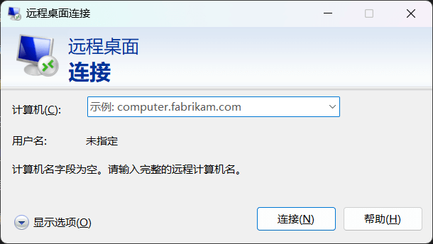
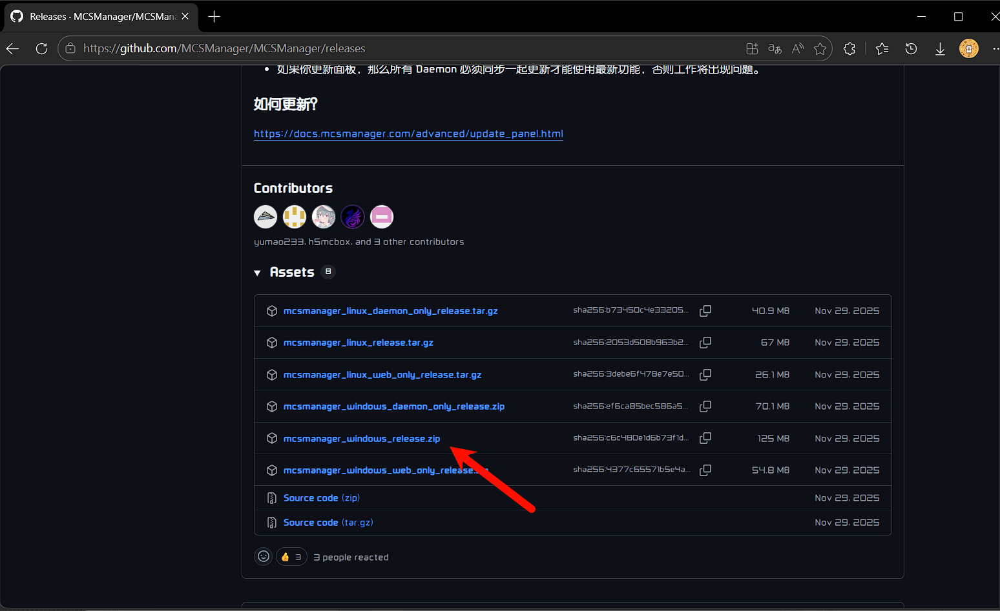
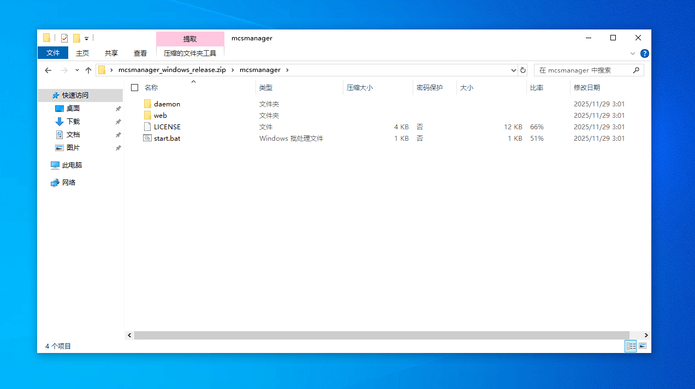
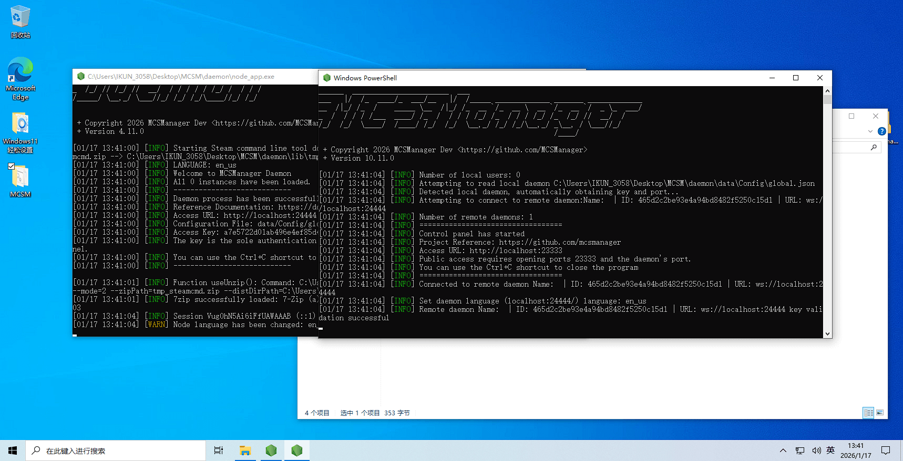
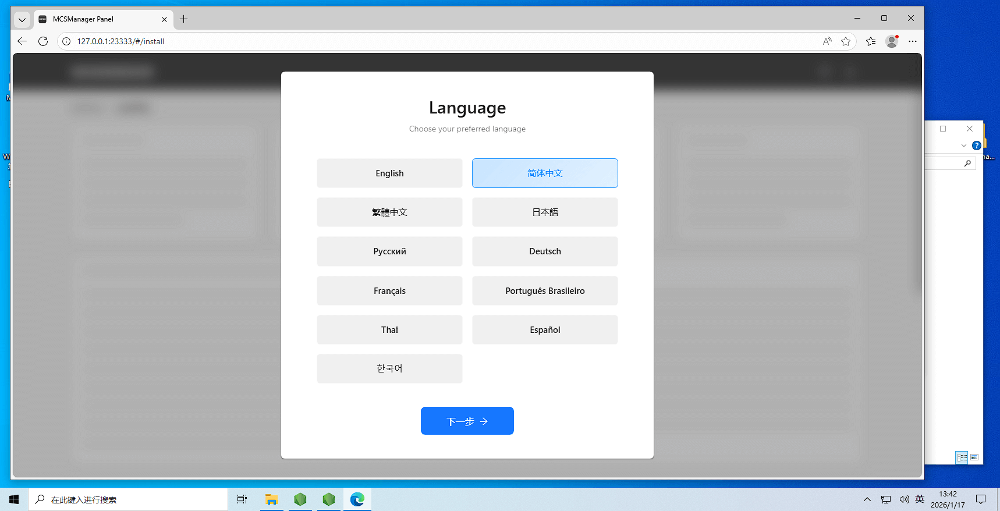
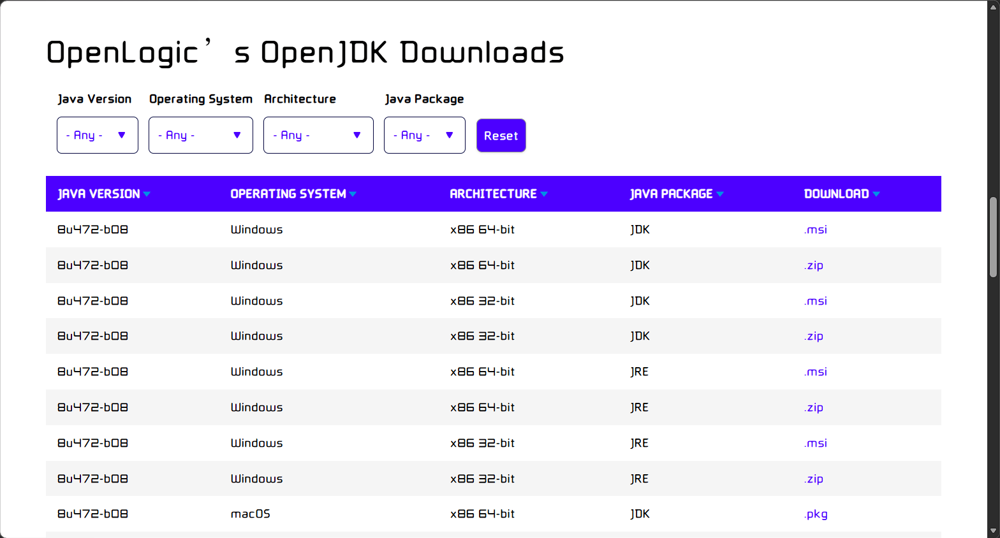

## 服务器的选择

之前的服务器是基于已经安装好MCSM面板的服务器

可以直接配置，开箱即用

服务器这一块还是推荐雨云

以极低的价格购买超高性价比VPS服务器

（我自己的都是雨云的产品，都挺不错的）

[雨云链接](https://www.rainyun.com/ikun3058_)


在这里选择你想要的服务器

（建议选择非中国内地服务器，免备案，推荐香港，免备案，延迟低）

系统这块选择Windows会更方便（当然Ubuntu啥的也可以，后文中全部默认你选择了Windows）

购买后，通过RDP连接服务器(使用Windows系统中的远程连接桌面)



## 正式开始搭建服务器

我这里以Windows 10虚拟机为例，和你的Windows Server是一样的

我将分两种方式搭建

### 方案一（推荐）

方案一将通过在Windows安装MCSM再在任意客户端的浏览器对服务器进行管理

1.打开MCSM的Github主页（科学上网，Steam++的网络加速也可以）

MCSM-Github主页

::github{repo="MCSManager/MCSManager"}

在releases（发行版页面）下载mcsmanager_windows_release.zip



[你可以点击此处直接开始下载（直接到服务器打开此文章下载）](https://github.com/MCSManager/MCSManager/releases/download/v10.11.0/mcsmanager_windows_release.zip)

解压他，得到这些文件



双击start.bat，运行MCSM



此时，在任意电脑上用浏览器打开MCSM

地址：服务器IP:23333



接下来开始配置MCSM面板，按照提示一步一步填写表单就好

然后新建应用，在应用市场选择你的MC版本后即可

然后去客户端MC，IP:端口，进入服务器就好

如果你需要关闭服务器，请在两个CMD窗口中按下Ctrl+C关闭

### 方案二（备选）

如果你不喜欢面板管理（虽然他更简单）那么你就可以选择这个办法

搭建你的服务器

首先你需要安装Java

打开这个链接滑到下方选择版本，下载安装包。链接：[https://www.openlogic.com/openjdk-downloads](https://www.openlogic.com/openjdk-downloads)



接下来请下载服务器核心

[MCSL-Sync-一个MC服务器核心镜像站](https://sync.mcsl.com.cn/)

这个网站收录了大部分服务器核心

下载它（应是一个.Jar文件）

在你的服务器中新建一个文件夹，用于存放服务器文件

新建一个文本文档，填写以下命令

```
java -Xms128M -XX:MaxRAMPercentage=85.0 -jar Paper-1.21.11.jar
```

其中：

128MB：是你的内存限制

Paper-1.21.11.jar：是你当前目录下的Jar文件名

按照你的需求修改好之后，将这个TXT文件的后缀修改为BAT

双击运行

部分核心可能显示同意Eula协议

需要去eula.txt中修改将其中的 eula=false 改为 eula=true（这代表你同意了mojang的协议Eula）

接下来再次启动服务器，应该就可以正常启动服务器了

## 配置服务器

在server.properties文件中可以修改非常多关于服务器的配置

其中就包括在线（正版）验证、游戏模式，OP玩家数量，等等

（如果你通过离线登录无法进入服务器，请修改“在线（正版）验证”）

JAVA服务器server.properties配置说明（来自雨云）：[https://www.rainyun.com/docs/guide/Minecraft/Minecraft_Guidebook](https://www.rainyun.com/docs/guide/Minecraft/Minecraft_Guidebook)

配置完成后，重新启动服务端就好

## 安装MOD

在安装服务器的时候选择了Fabric/Forge的服务端时，你就可以安装MOD

在根目录下的mods文件夹中放入你安装的mod

注意:MC的MOD分服务端和客户端，一般情况下来说，在MC百科上就可以看到是否需要服务端

你也可以直接给你客户端中的所有MOD全部上传到服务器上，避免了一个一个去看MOD性质

如果出现兼容性问题请查看时候安装了前置MOD

若你的MOD出现问题请查看MC百科[https://www.mcmod.cn/](https://www.mcmod.cn/)

最后，还是预祝大家成功搭建好自己的服务器
