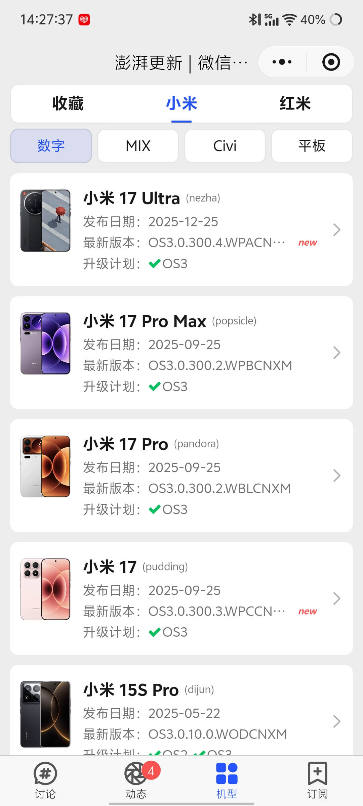
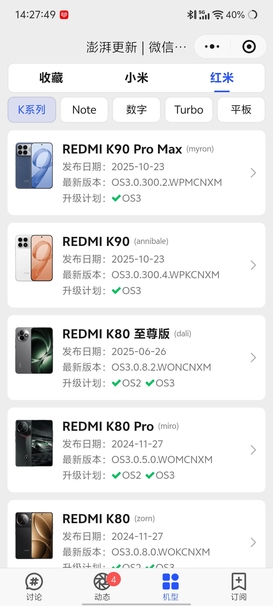
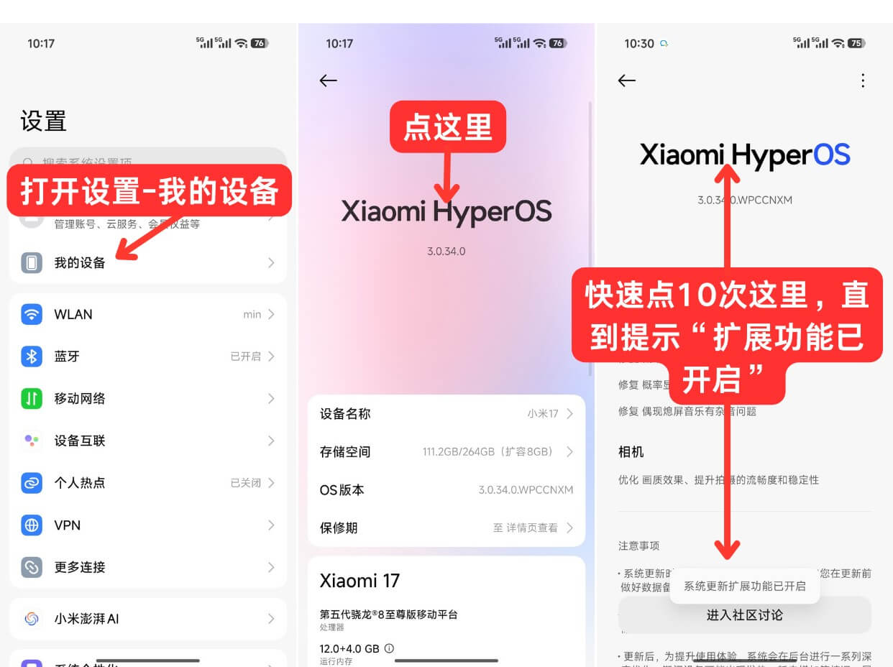
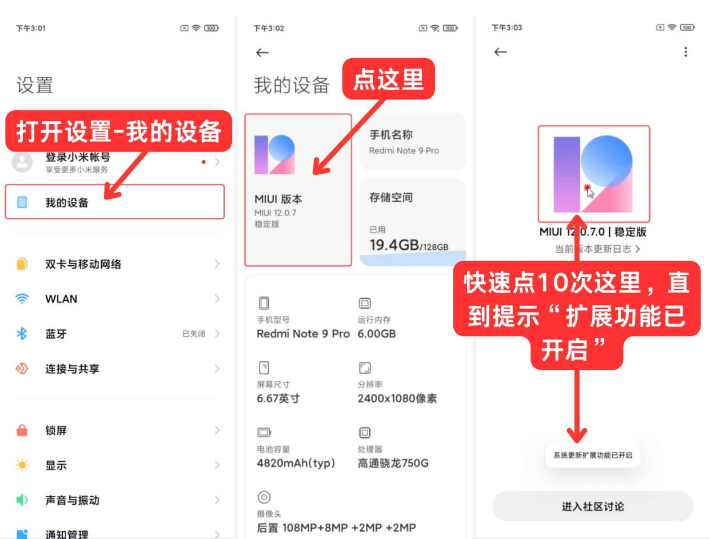
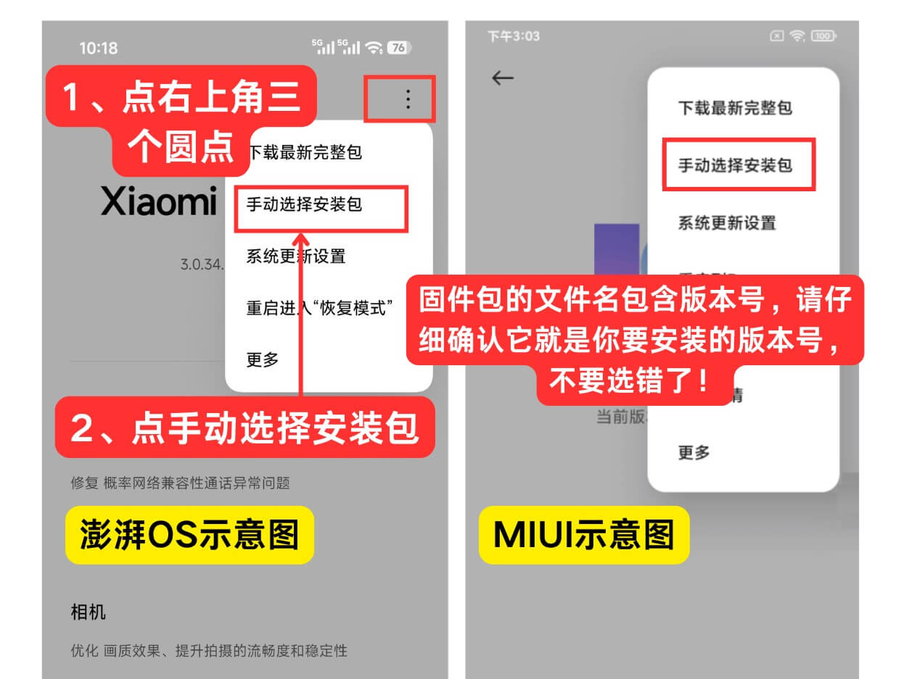
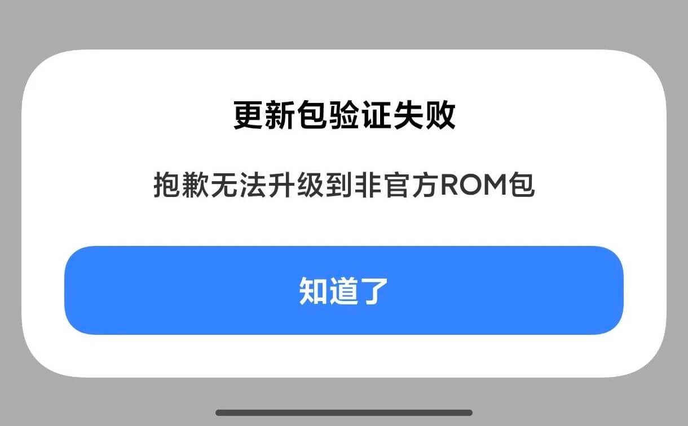
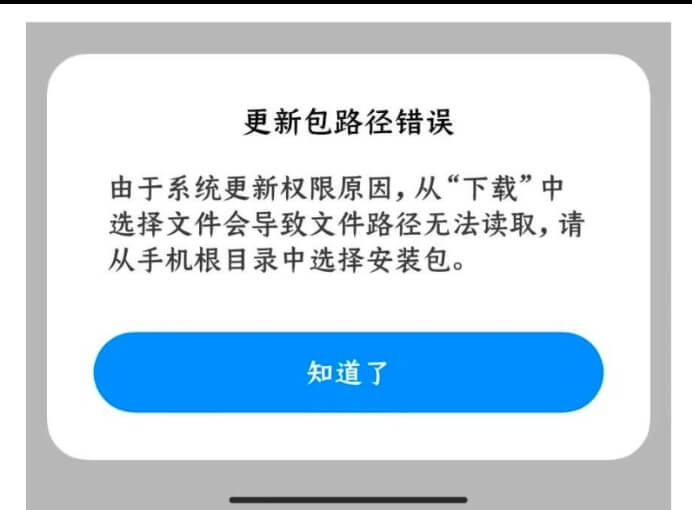
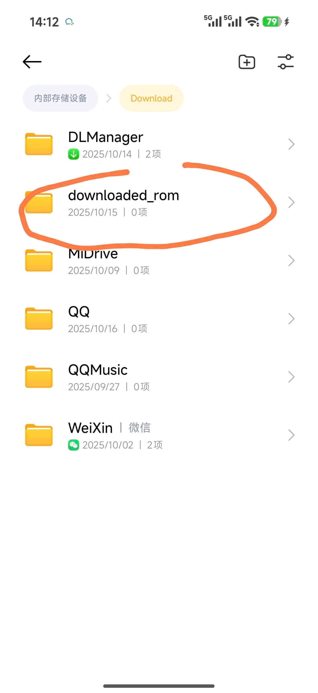

## 如何获取小米手机的官方升级包

答：通过“澎湃更新”小程序

在这个小程序当中可以直接看到小米手机每款机型的升级情况，当然，所有的系统包都是小米官方的包，而不是任何第三方来源的，在小程序中获取到的链接，都是来自小米发布的OTA包

也可以在小程序中看到每个机型对应版本号的状态，比如：公开、内测、撤包等等

在小程序中获取下载链接

示例：[REDMI K60至尊版OS3.0包下载链接（点击下载）](https://ultimateota.d.miui.com/OS3.0.3.0.WMLCNXM/corot-ota_full-OS3.0.3.0.WMLCNXM-user-16.0-0c145b73d2.zip?t=1769230464&s=ca33ef4ce605b88d2d344d15833b61db)

## 如何安装下载到的包

**注意，本教程只适用于安装公开的安装包，而不是内测或撤包的包**

在小程序中下载完成之后，请确保你知道你下载这个ZIP文件的目录，比如在“Download”文件夹下

下面是较为详细的教程

### 开启更新扩展功能

1.打开“设置”，点击“我的设备”

2.点击顶部“Xiaomi HyperOS”并进入更新页

3.快速点击“Xiaomi HyperOS”图标大约10次

图片示例：

### 选择安装包

1.点击右上角菜单，点击“手动选择安装包”

2.在打开的界面下找到你下载下来的ZIP系统安装包

### 开始安装

看到类似“是否立即更新”的提示，点击“更新”，接下来就是漫长的安装过程

## 问题说明

你先要确定你下载到的是不是你对应机型的安装包（很重要），如果是的请按照下面的操作

打开“文件管理”找到你的安装包，长按选择移动，移动到“内置存储/Download/downloaded_rom”文件夹下即可

如果更新出现问题，请立即前往附近的小米之家售后处理（一般应该还是没啥事的）