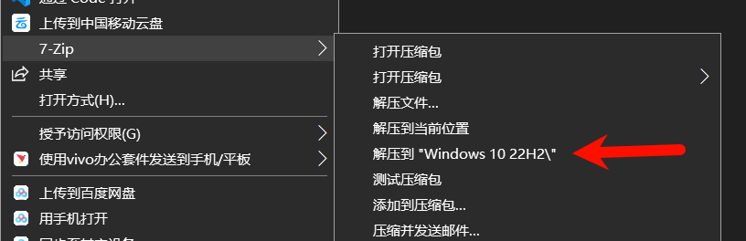
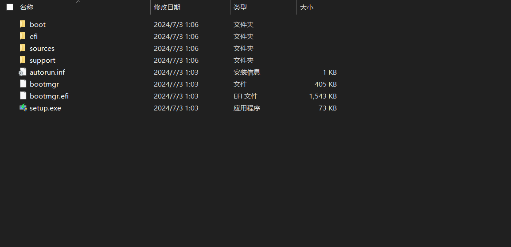
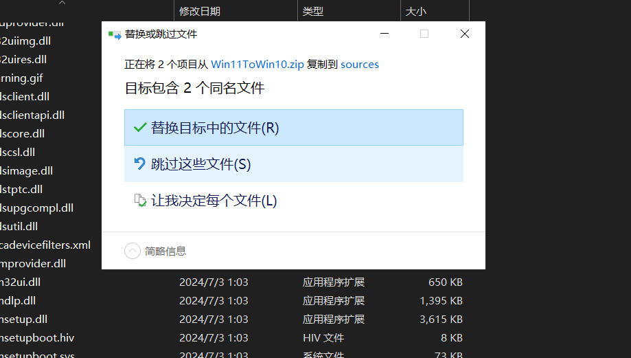
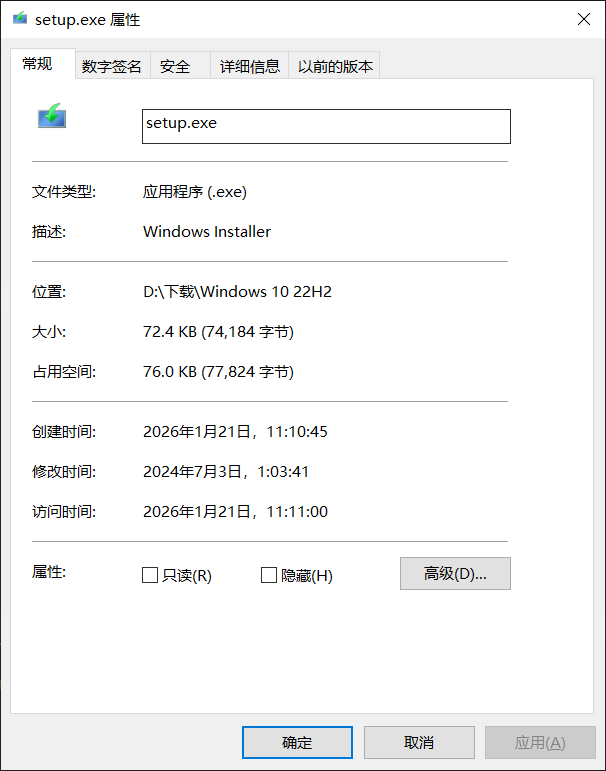
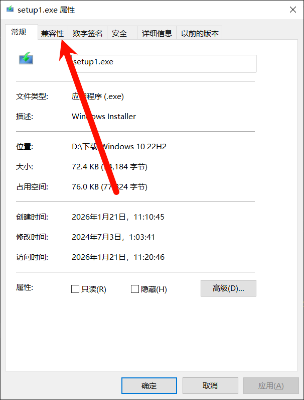
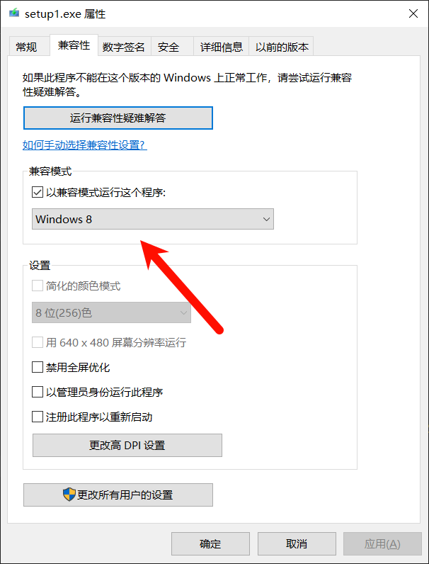
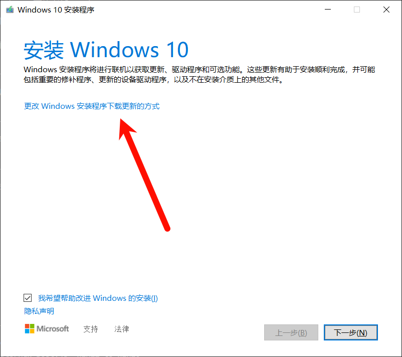
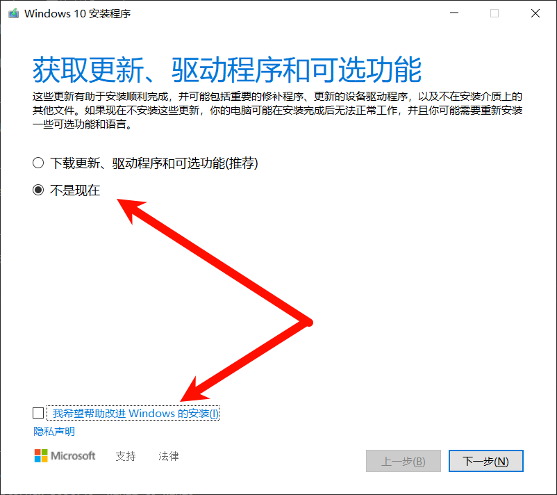

## 准备工作

你需要准备以下内容才可以正常进行操作

1.一台Windows11电脑

2.一个PEU盘（非常重要！！！）

PE这一块我只推荐这两个

[微PE](https://www.wepe.com.cn/)

[FirPE](https://www.firpe.cn/)

3.一个Windows10 22H2镜像（可以在MSDN下载）

[MSDN下载站](https://next.itellyou.cn/)

[官方下载](https://www.microsoft.com/zh-cn/software-download/windows10)

4.Windows 11轻松设置工具（说是Windows11的其实拿来优化下Windows10没啥问题）

## 正式开始操作之前的提醒

再次提醒，准备好你的PE盘

首先，这种操作属于官方形式的升级，所以不需要担心电脑时候会出现问题，并且可以保留所有Windows中已经安装好的软件

当然，还是建议你备份

## 退出账户并清除密码、PIN

打开你的设置，账户界面下，找到Microsoft账户，点击“改用本地账户登录”

（如果你本来就是本地账户可以忽略这一步）

再去“Windows Hello”找到PIN，点击删除

然后再去密码里面，点“更改密码”输入原先密码，然后不填新密码和密码提示，点击更改

然后按下win+L锁屏，解锁时直接显示“登录”按钮，而并非时密码框的时候，表示你已经成功完成这一步了

## 安装任意解压软件并修改镜像

首先你需要一个解压软件（推荐7ZIP和Bandizip）

右键你的Windows10镜像，点击解压到文件夹中



你会得到这些文件与文件夹



然后你需要对这个镜像进行修改

[点击此处下载所需要的文件](https://ikunajwoutlook-my.sharepoint.com/:u:/g/personal/ikun3058_131124_xyz/IQCdLPRMUXsoRb3sTWJPqAtaAVxzY5z6p5ODouOFCb7AlFA?e=1SZGjb)

下载这个压缩包（左上角有下载按钮）

将其复制到ISO文件夹下的“sources”文件夹并替换其中已有的文件



接下来再运行setup.exe之前，还需要对setup.exe进行修改

将setup.exe重命名为setup1.exe

（看似没有作用其实还是有用的）

修改前



修改后（多出来了一个兼容性选项）



在兼容性选项中，使用Windows8运行



## 正式开始安装

接下来，拔掉网线或关闭WLAN（必须断网执行接下来的操作），然后双击运行setup.exe

点击“更改Windows安装程序下载更新的方式”



点击“不是现在”，并取消勾选“我希望帮助改进Windows的安装”



然后一路下一步，点击安装，等待安装即可

等到进入桌面，你会发现，全屏黑屏，只有鼠标指针，点击还有错误提示音

## 修复并成功进入桌面

重新启动至PE系统（前文提示了准备PEU盘）

进入PE系统后，打开此电脑，进入以下目录

```
C:\ProgramData\Microsoft\Windows\AppRepository\
```

删除所有以“StateRepository”开头的文件（文件夹）

再次开机，应该可以成功进入桌面了

## 修复系统并恢复系统软件

打开PowerShell（管理员）

分条执行下面的指令，修复系统

```
Dism.exe /Online /Cleanup-Image /CheckHealth
```

```
DISM.exe /Online /Cleanup-image /Scanhealth
```

```
DISM.exe /Online /Cleanup-image /Restorehealth
```

```
sfc /scannow
```

执行完上面的指令之后，执行下面的，恢复系统软件

恢复系统应用：

```
add-appxpackage -register "C:\Windows\SystemApps\*\AppxManifest.xml" -disabledevelopmentmode
```

恢复内置应用：

```
add-appxpackage -DisableDevelopmentMode -Register "C:\ProgramData\Microsoft\Windows\AppRepository\*\AppxManifest.xml" -verbose
```

恢复应用商店安装的应用：

```
add-appxpackage -DisableDevelopmentMode -Register "C:\Program Files\WindowsApps\*\AppxManifest.xml" -verbose
```

## 使用Windows11轻松设置工具优化系统

[原作者BiliBili专栏](https://www.bilibili.com/opus/904672369138729017)

打开这个专栏下面的下载地址，下载并解压，运行exe，自定义你的Windows10

（包含安装常用软件、暂停更新、系统信息等等）

（当然你也可以不降级Windows10，使用这个工具进行优化你的Windows11）

那么现在，你的Windows11已经完美“升级”至Windows10了