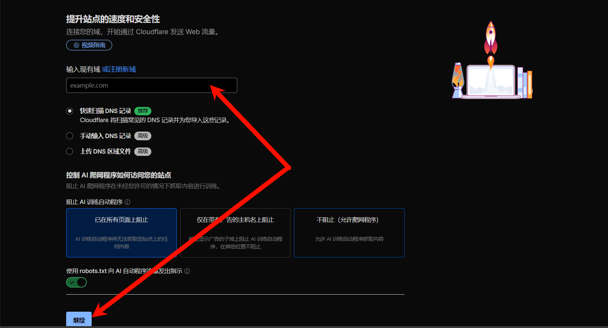
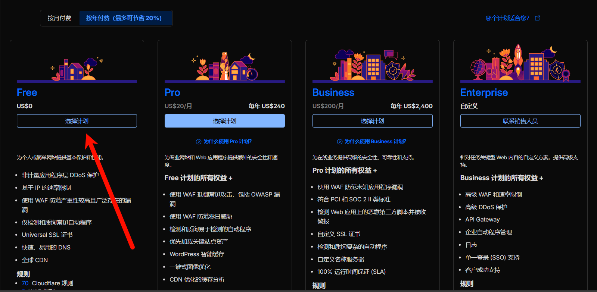
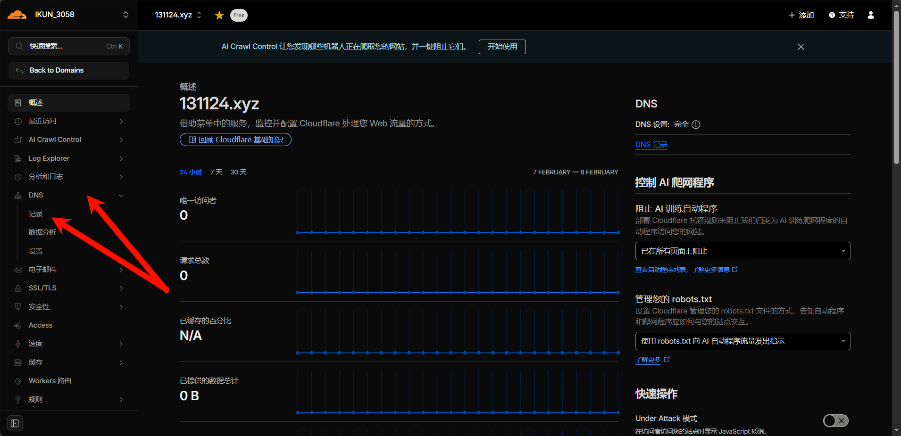
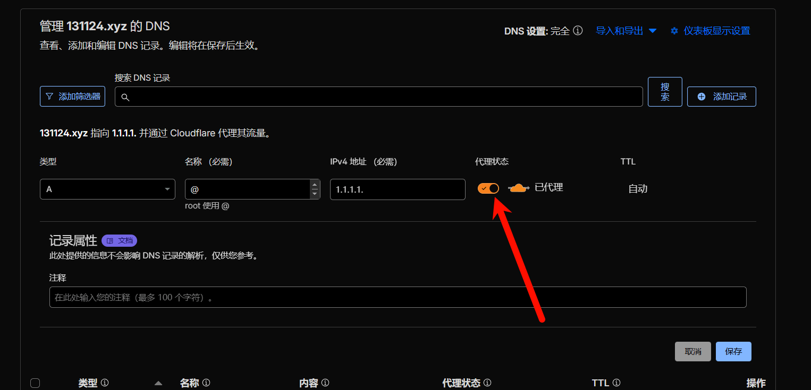
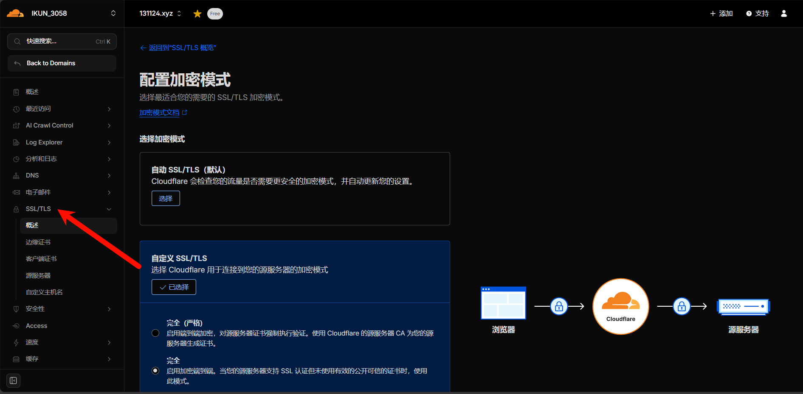
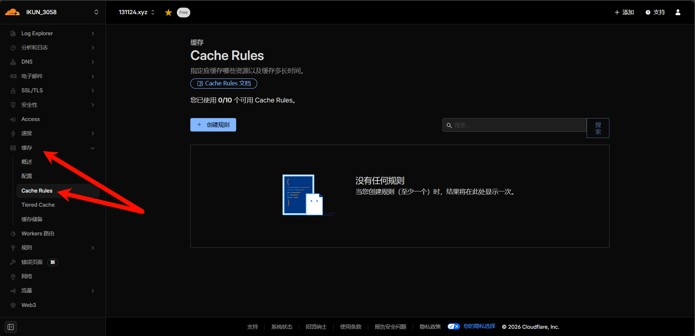

## CDN的作用

CDN 是 Content Delivery Network（内容分发网络）的缩写，核心是通过全球分布式边缘节点缓存内容，让用户就近获取数据，从而加速访问、减轻源站压力、提升稳定性与安全性，是网站 / 应用的 “加速与抗灾网络”。

**核心原理（4 步极简版）**

- 预缓存：将源站的静态资源（图片、视频、CSS/JS、安装包等）复制到各地边缘节点。

- 智能调度：用户请求时，CDN 通过 DNS / 调度系统，将请求路由到距离最近、负载最低的边缘节点。

- 就近响应：边缘节点有缓存则直接返回，无缓存则 “回源” 获取并缓存后再响应。

- 负载与安全：分散流量防源站过载，同时提供 DDoS 防护、HTTPS 等安全能力。

**典型应用场景：**

网站加速（静态资源、HTML）、视频 / 直播分发、软件 / 游戏下载、API / 动态加速、IoT / 移动应用加速。

**常见 CDN 服务商（适合个人博客）：**

- 国内：阿里云 CDN、腾讯云 CDN、百度智能云 CDN（新用户常有免费额度）。

- 国外 / 全球：Cloudflare（免费入门友好）、Akamai、Fastly。

## 如何正确套CDN

**总的来说就这四步，详细的请继续往下看：**

1. 注册 CDN 服务商，添加你的域名并完成域名解析（CNAME 指向 CDN 提供的域名）。

2. 配置缓存规则（如缓存图片 / CSS/JS，设置合理过期时间）。

3. 开启 HTTPS（服务商通常提供免费证书），优化静态资源（压缩、合并）。

4. 测试访问速度与节点响应，根据数据调整规则。

我会以**全球最常用、免费且易上手的 Cloudflare** 为例（适合个人博客），一步步带你完成配置，同时也会标注国内 CDN（阿里云 / 腾讯云）的核心差异，确保你能跟着操作落地。

### 前置准备

1. 已拥有自己的域名（如 `example.com`，不推荐免费二级域名，推荐在[SpaceShip](https://www.spaceship.com/zh/)注册）。

2. 已部署好静态博客（GitHub Pages/Gitee Pages 均可），能通过源站地址正常访问。

3. 注册 Cloudflare 账号（免费版足够个人使用）。

### 添加域名到CloudFlare

注册好你的域名之后，你需要添加域名到CloudFlare中

1. 登录 Cloudflare 后，点击首页 `加入域`，输入你的博客域名（如 `example.com`），点击 `继续`。

2. Cloudflare 会自动扫描你的域名现有 DNS 记录（如 A 记录、CNAME 记录），耐心等待扫描完成。

3. 选择套餐：推荐免费版 `Free`，点击 `继续`。

4. CloudFlare会给出两个NS名称服务器，在你的域名购买商的网站中找到`修改名称服务器`或者`DNS服务器设置`字样。
5. 删除原有 DNS 服务器，替换为 Cloudflare 提供的 2 个地址，保存修改。
6. 回到 Cloudflare 点击 `检查名称服务器`，等待 DNS 生效（通常 10 分钟～24 小时，多数情况 30 分钟内生效）。

### 配置DNS记录，开启CloudFlare的代理功能

1. 打开`DNS记录`界面

2. 添加你需要的A记录（AAAA记录）、CNAME记录，并开启代理（即CloudFlare CDN）

:::warning[注意]
**代理状态必须是橙色云朵（Proxied）**，这代表流量走 Cloudflare CDN；如果是灰色（DNS Only），则仅解析不加速。
:::

## 配置CDN

1. 在CloudFlare中你的域名界面下点击`SSL/TLS`选项

2. 在此界面下配置SSL证书，，开启Https，避免浏览器显示不安全

3. 配置缓存规则

**规则 1：高频更新页面（首页 / 文章页）短缓存**

- Rule name：`Short Cache for Dynamic Pages`
- When incoming requests match：`URI Path` 匹配 `/*`（所有页面）**且** `File Extension` 匹配 `html`
- Cache status：`Cache Everything`
- TTL：`300 seconds`（5 分钟，平衡速度和更新及时性）

**规则 2：静态资源（图片 / CSS/JS）长缓存**

- Rule name：`Long Cache for Static Assets`
- When incoming requests match：`File Extension` 匹配 `jpg, png, gif, css, js, svg`
- Cache status：`Cache Everything`
- TTL：`86400 seconds`（1 天，减少回源）

4. 在改变网页内容时，手动刷新 CDN 缓存：

- 每次部署后，手动刷新 CDN 缓存：

- 进入 Cloudflare 后台 `Caching` → `Purge Cache`。

- 选择 `Purge everything`（刷新所有缓存），或输入具体 URL（如 `https://yourblog.com/2026/02/new-post/`）刷新单页面。

- 点击 `Purge`，等待 1~2 分钟即可生效。

## 国内CDN的差异

如果你的访客主要在国内，推荐用阿里云 / 腾讯云 CDN，核心步骤差异如下：

1. **备案要求**：国内 CDN 必须先完成域名备案（Cloudflare 无需备案），备案完成后才能接入。

2. **接入方式**：

   - 登录阿里云 / 腾讯云 CDN 控制台，添加 “加速域名”，选择 “静态网站” 类型。

   - 设置 “源站地址”（你的博客服务器 IP 或 GitHub Pages 域名）。

   - 系统会生成 CNAME 域名，需在域名解析后台添加 CNAME 记录指向该域名。

3. **缓存配置**：在控制台 “缓存规则” 中设置 TTL，刷新缓存入口在 “缓存操作”→“刷新预热”。

## 验证CDN生效

配置完成后，验证是否成功接入：

1. 打开浏览器，访问你的博客域名，按 F12 打开开发者工具 → `Network` → 刷新页面。
2. 查看任意静态资源的 `Response Headers`，若包含 `CF-Cache-Status`（Cloudflare）或 `X-Cache`（阿里云 / 腾讯云），说明 CDN 已生效。
3. 也可通过 `ping` 指令，查看 IP，若 IP 不是你的源站 IP，而是 CDN 节点 IP，说明解析已生效。

## CDN的缺陷

CDN 虽好，但并非银弹。还需要注意以下几个核心缺点。了解这些能帮你避开 “踩坑”，做出更合适的技术选择。

1. **排查问题变复杂（链路变长）**

- **现象**：以前网站打不开，只看服务器日志就行；用了 CDN 后，问题可能出在：本地 DNS → CDN 节点 → CDN 回源 → 源站。

- 痛点

  - **缓存穿透 / 回源失败**：CDN 节点挂了或回源链路断了，用户看到 502/504 错误，你需要去 CDN 控制台查 “回源监控”。

  - **无法直接看源站**：你想测试源站是否正常，不能直接访问域名，必须改本地 Hosts 或者访问源站 IP，对新手有门槛。

**2. 配置不当会导致 “负优化”**

- **现象**：配置错误可能让网站比不用 CDN 还慢。

- 常见坑

  - **缓存规则错误**：把本应动态的内容（如评论计数）缓存了，导致数据不同步。

  - **HTTPS 证书不匹配**：CDN 开了 HTTPS，但源站证书过期或配置为 “Flexible”（CDN<-> 源站走 HTTP），可能被浏览器拦截或降低安全评分。

  - **不必要的插件**：部分 CDN 自带的 “火箭脚本” 或 “自动优化” 可能与博客的 JS 冲突，导致页面报错。

**3. 免费 / 共享节点的性能波动**

- **现象**：使用 Cloudflare 免费版等共享节点时，高峰期速度可能不稳定。

- **原因**：免费节点是多用户共享带宽和服务器资源的。如果同一节点上的其他网站发生流量攻击或大流量下载，会挤占你的带宽，导致博客访问变慢。

**4. 缓存问题**

**缓存过期时间（TTL）设置过长**

TTL（Time To Live）是 CDN 缓存资源的有效期，比如设置为`86400秒（1天）`，节点就会在 1 天内直接返回缓存内容，不会去源站检查是否更新。

如果你的博客频繁更新文章，过长的 TTL 就会导致新内容延迟生效。

**未主动触发缓存刷新**

即使 TTL 没到，只要手动操作刷新，就能让边缘节点丢弃旧缓存、重新从源站拉取最新内容。

很多新手忘记执行这一步，就会误以为 CDN “同步慢”。

**资源文件名未做版本化处理**

生成的静态资源（如`style.css`、`main.js`）如果文件名固定，即使内容更新，CDN 可能会认为这是同一个资源，继续返回旧缓存。

## 其他CDN推荐

免备案可用CDN：

- Edgeone CDN（腾讯云国际站）：

    - 不限流量；国内 + 海外节点；20 条页面规则；基础 DDoS/WAF；免费 SSL；支持 EdgeOne Pages

    - 国内节点多，访问快；规则灵活；可直接部署静态页

- ESA（阿里云边缘安全加速）：

    - 无限流量、全球节点（含中国大陆，需备案）、免费 SSL、基础 WAF/DDoS、边缘函数、Pages 托管

    - 个人博客、静态站点、低并发非生产场景，无 SLA 承诺

    - 每个 UID 限 1 个，无需信用卡，开通即用

    - 自动 HTTPS、基础 WAF、DDoS 缓解、静态资源缓存、智能路由