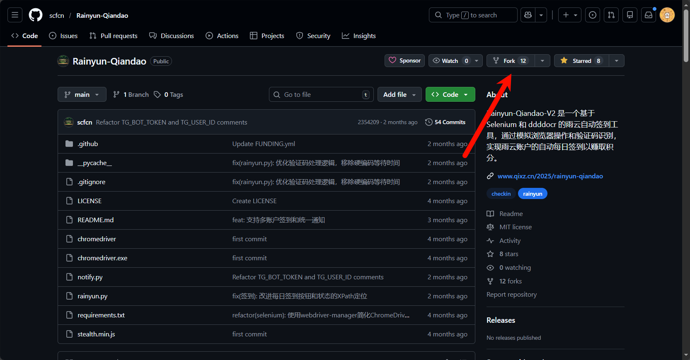
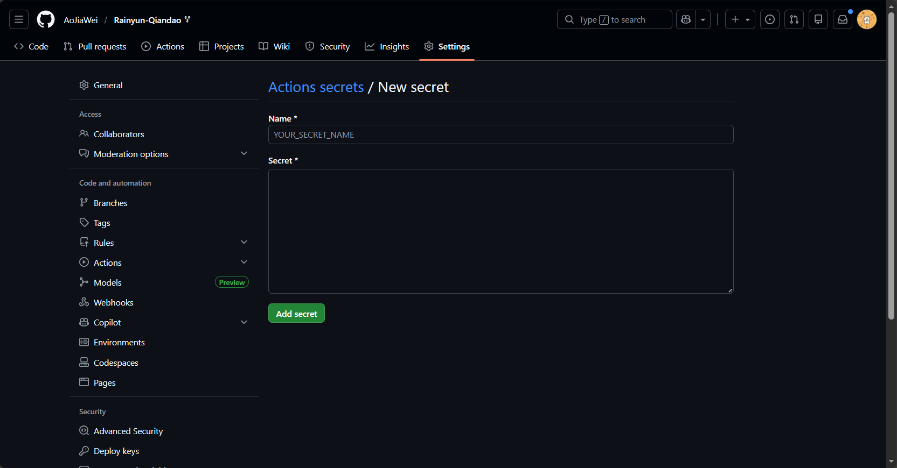

## 写在前面：

原作者博客文章地址

[https://www.qixz.cn/2025/rainyun-qiandao](https://www.qixz.cn/2025/rainyun-qiandao)

原项目：

::github{repo="SerendipityR-2022/Rainyun-Qiandao"}

后面有了衍生项目，通过GitHub Actions自动签到

::github{repo="scfcn/Rainyun-Qiandao"}

下面就是正式部署操作了

## Fork仓库

登录GitHub账户，在仓库界面点击Fork按钮，Fork到自己的账户上



## 配置账户信息，让脚本执行过程中正确登录账户

衍生项目作者为了避免Fork下来的仓库无法设置为私密仓库这一规定，给出了解决办法，就是在GitHub Secrets中配置

为了保护你的账户安全，我们需要在GitHub Secrets中配置登录信息，这样即使仓库是公开的，也不会泄露你的密码：

- 进入你Fork的仓库页面

- 点击右上角的Settings

- 在左侧导航栏中选择Secrets and variables → Actions

- 点击右上角的New repository secret

- 创建两个账户信息的秘密：

- 你的雨云账户用户名

```
RAINYUN_USER
```

- 你的雨云账户密码

```
RAINYUN_PASS
```



## 启用GitHub Actions

- 转到仓库的Actions页面

- 点击I understand my workflows, go ahead and enable them按钮启用工作流

- 在左侧工作流列表中选择Rainyun 自动签到

- 击右侧的Run workflow按钮，选择Run workflow来手动触发第一次运行

接下来等待脚本运行，很快就可以签到完成

手动运行一次之后，后面会在UTC+8的12点，自动运行脚本

:::tip[提示]
可能会有30分钟左右的偏差，这是正常现象
:::

## 扩展功能：配置通知服务

原项目中可以在脚本完成签到后进行通知推送服务：SMTP邮件等等

你的邮件、邮件密码（授权码）、SMTP服务器都可以在secrets中配置：

- SMTP 收发件邮箱，通知将会由自己发给自己

```
SMTP_EMAIL
```

- SMTP 收发件人姓名，可随意填写

```
SMTP_NAME
```

- SMTP 登录密码，也可能为特殊口令，视具体邮件服务商说明而定

```
SMTP_PASSWORD
```

- SMTP 发送邮件服务器，形如 smtp.exmail.qq.com:465
```
SMTP_SERVER
```

- SMTP 发送邮件服务器是否使用 SSL，填写 true 或 false

```
SMTP_SSL
```

配置完成后，再次运行脚本，你就会接收到一封邮件，用来通知你完成签到