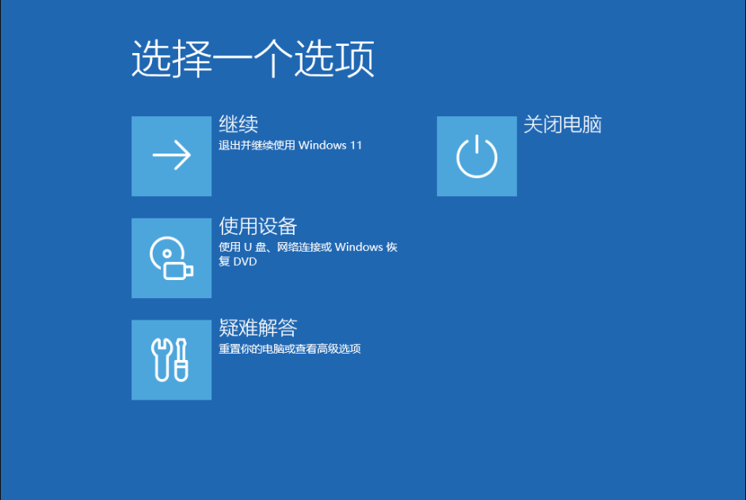
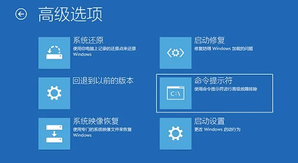

## 替换前的提醒

请在操作C:\Windows\Fonts文件夹下的文件时，创建备份，或只备份Fonts文件夹

操作需要进入WinRE模式进行替换，当然你也可以制作PE U盘进入PE进行替换

（更推荐后者）

替换后大部分应用都可以正常显示，不过也存在部分应用乱码情况，谨慎考虑！！！

## 获取已经注入元数据的字体文件

[来自B站UP主“NEORUAA”的蓝奏云分享链接，提取码：2333](https://www.lanzoum.com/b00qmebpe)

三个用于替换字体元数据的exe程序后面讲，你需要获取“misans替换包by NEORUAA.zip”文件

压缩包内包含宋体，如果你需要在任何文档内使用宋体，请不要替换它，避免直接全部显示为Mi Sans

win11下还有部分西文使用了SegoeUI，你也可以获取它一并替换，不过有些字体的字重会有问题

获取后，将他们解压到合适的位置（这里推荐存放在C:\misans\）文件夹下，待会进入WinRE可以直接用我给的命令进行操作替换

## 进入WinRE替换字体文件

如果不熟悉命令行操作，你可以继续往下看，下边有PE替换教程

### 如何进入WinRE

按住键盘上的Shift建并保持不松手的状态，使用鼠标点击“开始”，点击“电源”、点击“重启”

这时候看到显示“请稍后...”就说明进入了WinRE模式，此时来到一个全屏蓝色的界面



这是WinRE的主界面，此时我们需要进入命令提示符运行命令替换文件

点击“疑难解答”



### 查看当前盘符，以便后续操作

进入命令提示符之后你还需要一个操作，就是查看当前的C盘是否为正确的C盘（部分电脑会将C盘显示为EFI盘）

你可以运行这条指令打开一个记事本

```
notepad
```

在记事本的选项卡中选择“文件”

点击“另存为”

此时会显示一个资源管理器窗口，左侧选择此电脑，就可以进入C盘查看是否为正确的C盘

### 使用命令进行替换

如果正确，请在命令提示符中运行这条命令

```
xcopy C:\Fonts C:\Windows\Fonts
```

:::warning
盘符选择你原来的C盘，并且你的misans的压缩包解压在C:\Fonts文件夹的根目录
:::

重启查看字体是否生效

## 使用PE进行替换

你需要一个U盘制作PE

此时你也可以在PE内进行备份操作

进入PE，使用PE内的资源管理器替换进C:\Windows\Fonts文件夹内

直接重启，就可以查看字体是否生效，如果有不稳定的情况，你可以考虑恢复你的备份