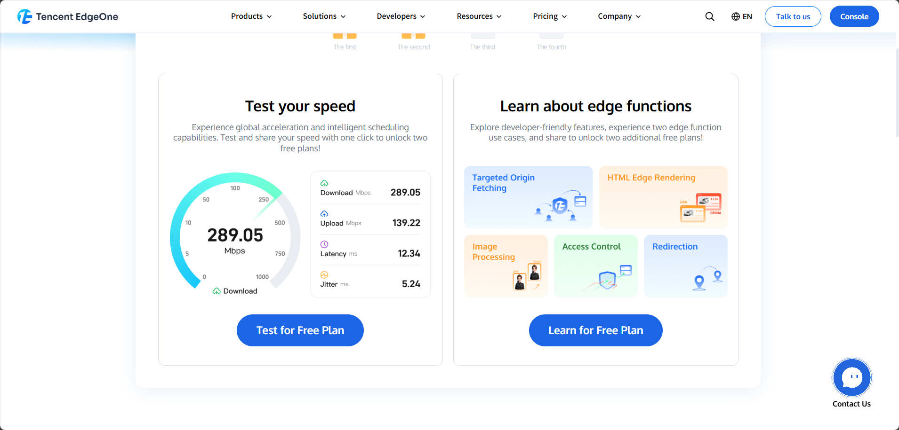
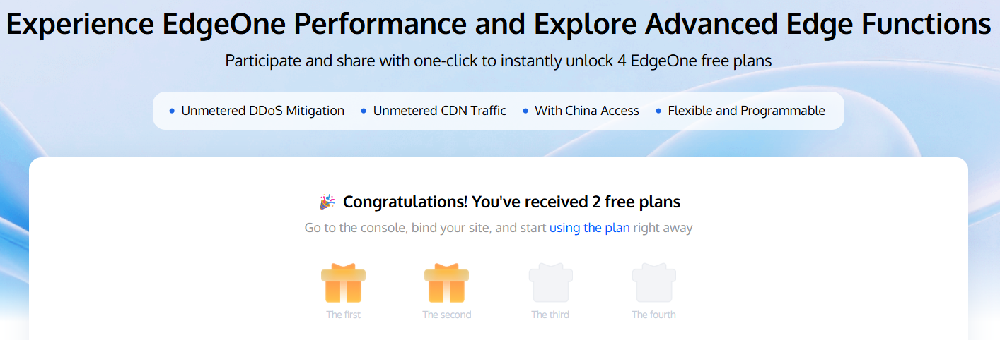
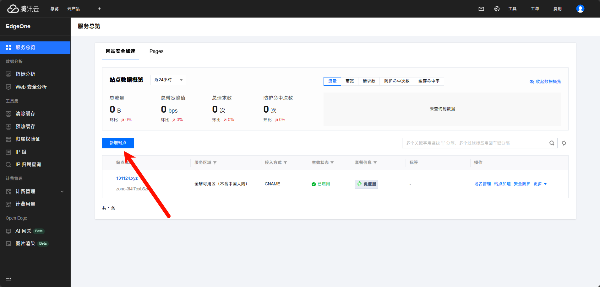
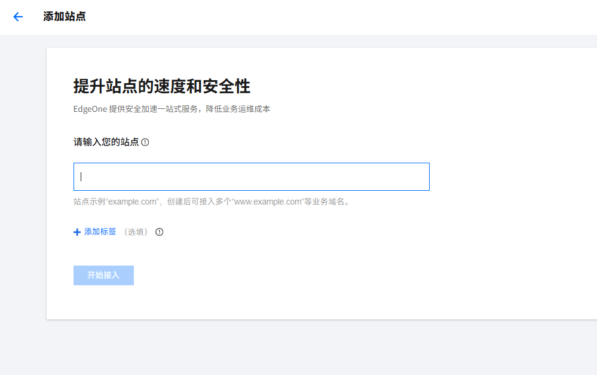
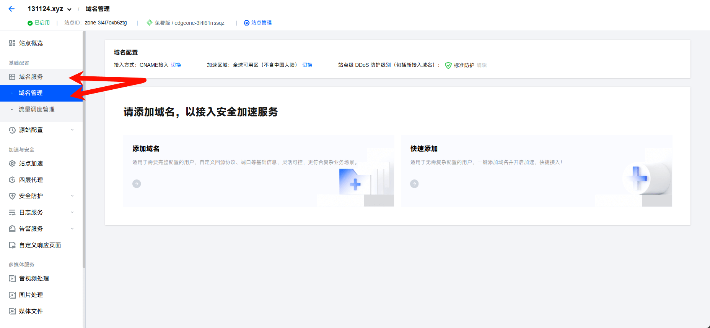
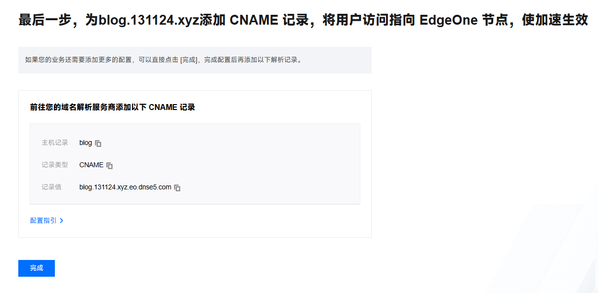
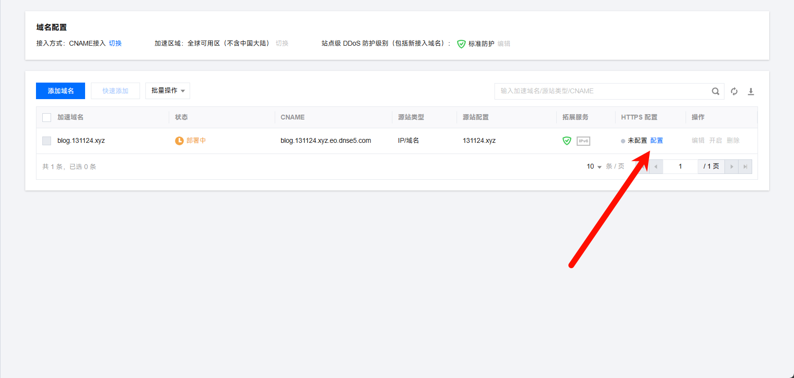
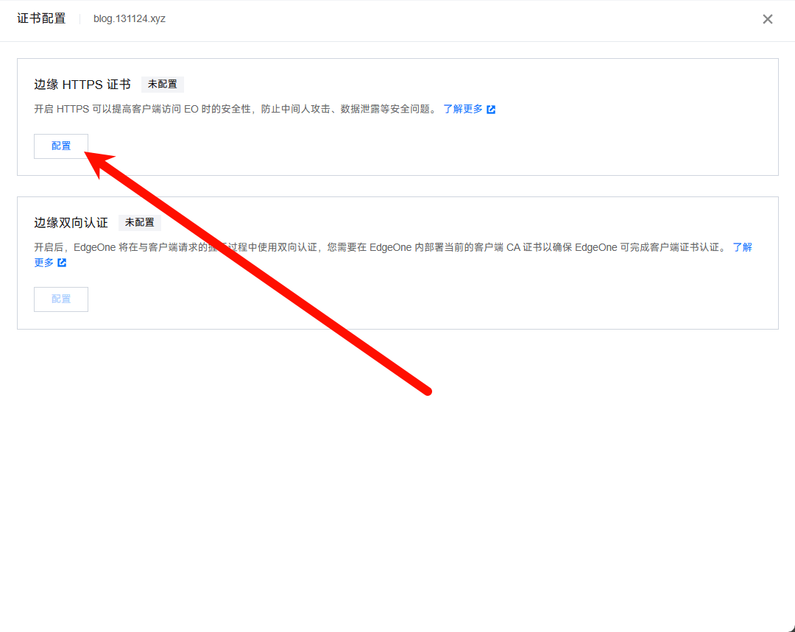
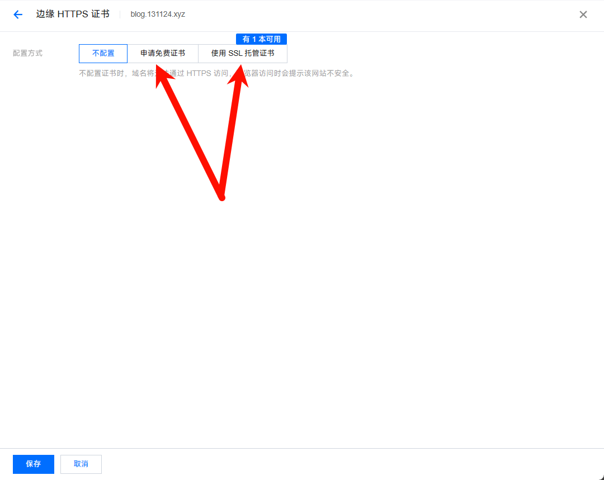
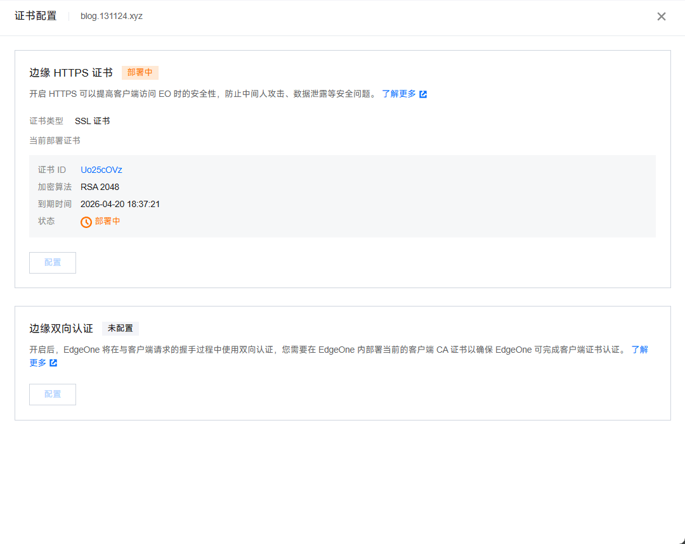

## 了解Edgeone

EdgeOne 通常指 腾讯云边缘安全加速平台（Tencent Cloud EdgeOne，简称 EO），是腾讯云推出的一体化边缘服务平台，主打边缘加速、安全防护、边缘计算三大核心能力。

1. 核心定位与能力

- 边缘加速：依托全球数千个边缘节点，提供静态 / 动态内容分发、智能路由、HTTP/3/QUIC 等，大幅降低访问延迟。

- 安全防护：内置 DDoS 清洗、WAF、Bot 管理、CC 防护、AI 爬虫控制 等，按 “干净流量” 计费Tencent EdgeOne。

- 边缘计算：支持 Edge Functions（边缘函数），在边缘节点就近运行 JS 代码，减轻源站压力。

2. EdgeOne Pages

EdgeOne Pages 是基于 EdgeOne 打造的前端 / 全栈部署平台，主打：

- Serverless 部署：无需服务器，一键部署静态站、SSR 应用（Next.js、Astro、Nuxt 等）Tencent EdgeOne。

- 全球加速 + 安全：自动接入 EdgeOne 加速与防护，自带免费 SSL、自定义域名Tencent EdgeOne。

- 边缘能力：支持 Pages Functions、KV 存储，实现边缘动态逻辑Tencent EdgeOne。

## Edgeone CDN、CloudFlare CDN和ESA

**Cloudflare**

- 全球 Anycast 网络，海外访问延迟低。

- 国内访问：无大陆节点，延迟高、不稳定。

- 协议：HTTP/3/QUIC、Brotli 压缩、智能路由。

**EdgeOne**

- 国内：延迟极低、秒开，实测比 Cloudflare 快 3 倍。

- 全球：亚太节点密集，适合出海 / 跨境业务Tencent EdgeOne。

- 架构：边缘节点 + 区域中心两级，跨国回源优化更好。

|功能|CloudFlare CDN|Edgeone CDN|
|-|-|-|
|DDoS 防护|基础防护|L3/L4/L7 平台级防护，25+ Tbps 带宽Tencent EdgeOne|
|WAF|无|基础规则集（SQL/XSS/ 注入）|
|CC/Bot|基础限流|内置 CC、Bot 管理、验证码Tencent EdgeOne|
|免费 SSL|是|是（自动续期）|
|页面规则|3 条|20 条|

**合规与监管**

- Cloudflare：境外合规，不支持中国大陆备案与合规要求。

- EdgeOne：完全符合中国网络合规，支持备案、内容审核、数据本地化。

**适用场景与选择建议**

**Cloudflare**

网站主要面向海外用户（欧美为主）。

需要成熟的边缘生态（Workers、R2、Pages）。

追求全球统一 Anycast 网络与低延迟。

无需中国大陆合规与备案。

**优先选 EdgeOne**

网站主要面向中国大陆 / 亚太用户。

需要国内低延迟、合规备案。

希望安全 + 加速 + 边缘计算一站式，且成本可控。

已在使用腾讯云（COS、CVM、Serverless），追求生态集成。

## 获取Edgeone CDN免费额度（最高四个）

### 通过官方活动获取Edgeone免费版套餐

[Edgeone获取免费套餐传送门](https://edgeone.ai/get-free-plan)

通过“Test your speed”（测速）后点击分享获取两个套餐

### 添加域名启动网站安全加速

[点击进入Edgeone控制台](https://console.tencentcloud.com/edgeone)

点击新增站点，输入你的域名

选择你的免费版套餐完成新增，点击你的域名进入你的站点

添加域名，输入源站，在DNS记录中添加CNAME，即可进行网站安全加速

### 配置SSL，开启Https

还是在域名管理界面

现在还是在部署中，我们可以先配置SSL

你可以使用自己曾经买的SSL，或者别的平台的免费证书，但是还是推荐使用Edgeone平台给的免费证书，有自动续费功能

稍等一会儿，一杯咖啡的时间，再次访问你的域名，你就可以打开你的网站了，你还可以在“站点加速”菜单内配置一些其他功能

最重要的就是“节点缓存 TTL”、“浏览器缓存 TTL”

设置一个比较低的值，以便更好的更新网页内容

总的来说，Edgeone是个不错的平台，像是本站就是使用了Edgeone Pages+Edgeone CDN搭建的网站，这样的话建站成本应该就是域名了