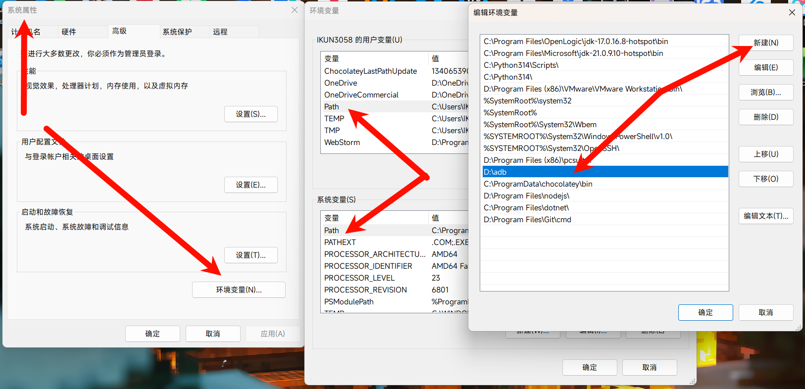

## 什么是ADB？

Android 调试桥 (adb) 是一种功能多样的命令行工具，可与设备进行通信。adb 命令可用于执行各种设备操作（例如安装和调试应用），并提供对 Unix shell（可用来在设备上运行各种命令）的访问权限。
对于玩机用户来说，ADB的权限处于$和#之间，因此可以在不ROOT的情况下对设备进行一些特殊操作，但必须借助电脑。如果不使用电脑，则需要使用SU来获取权限。

## 下载与链接

ADB工具可以从Android SDK平台工具包中下载，链接如下：

[Android SDK Platform Tools](https://developer.android.com/studio/releases/platform-tools)

下载完成后，解压缩文件并将其路径添加到系统环境变量中（如图），以便在命令行中直接使用adb命令。

(当你下载到的压缩包解压到了D:\adb目录下)



## ADB常用命令清单

以下是一些常用的ADB命令清单：

### 基础命令

开始前，请先记住下文出现的

- ``<pkg>``代表包名

- ``<act>``代表app活动界面

- ``<url>``代表网页连接路径

- ``<urlC>``代表电脑端文件路径

- ``<urlP>``代表手机端文件路径

### 服务与连接

```
adb start-server
```
启用ADB服务
```
adb kill-server
```
关闭ADB服务
```
adb devices
```
列出ADB设备
```
adb -s
```
使用指定ADB设备。s填写上一步列出的序列号
```
adb tcpip 5555
```
设置端口转发为5555，配合下面一条可开启网络调试
```
adb connect xxx.xxx.xxx.xxx:5555
```
4个xxx代表手机局域网IP，在关于手机，状态信息，拉到最下面找到IPv4地址
```
adb disconnect xxx.xxx.xxx.xxx:1234
```
断开网络调试
```
adb usb
```
使用usb连接
```
adb root
```
使用root模式。前提是已经获取root，相当于在手机终端输入su
```
adb reboot
```
重启设备
```
adb reboot recovery(fastboot)
```
重启到rec模式(fb模式)

### 安装与卸载软件
```
adb install "<urlC>"
```
安装电脑端的apk

(路径加引号是为了避免文件夹出现空格)
```
adb install -r "<urlC>"
```
覆盖安装(升级)
```
adb install -s "<urlC>"
```
安装到sd卡
```
adb uninstall <pkg>
```
卸载软件(仅第三方)
```
adb uninstall -k <pkg>
```
卸载软件但保留数据

### 传输文件
```
adb push "<urlC>" <urlP>
```
推送电脑上的文件到手机(手机路径可手动填写，若文件夹不存在会自动创建)

### 活动管理器
```
adb shell am start <pkg>/<act>
```
启动app并打开指定界面
```
adb shell am force-stop <pkg>
```
强制停止app(执行后app会直接闪退)
```
adb shell am start -a android.intent.action.VIEW -d <url> -p <pkg>
```
使用指定app打开某个网页链接

### 包管理器
```
adb shell pm disable-user <pkg>
```
禁用系统app
```
adb shell pm enable <pkg>
```
启用系统app，和上一条配合使用
```
adb shell pm install <urlP>
```
安装手机内的apk文件。注意和不带shell pm的要区分开！路径前也可以跟随之前介绍的几个参数。
```
adb shell pm uninstall <pkg>
```
卸载软件。注意：如果带 "--user 0"参数,则可“卸载”系统软件，但并不是真正的卸载
```
adb shell pm clear <pkg>
```
清除所有数据，恢复到初始安装后的状态
```
adb shell pm list package -f
```
列出apk的安装位置与对应包名
```
adb shell pm list package -d
```
列出禁用的包名，仅限系统应用
```
adb shell pm list package -e
```
列出启用的包名，仅限系统应用
```
adb shell pm list package -s
```
列出所有系统应用包名
```
adb shell pm list package -3
```
列出第三方应用包名
```
adb shell pm list package -i
```
列出软件对应的安装来源的包名
```
adb shell pm list package -u
```
列出被卸载过的软件的包名

### 按键与触摸模拟
```
adb shell input text “xxx”
```
向设备输入xxx字符(不支持中文，同样是因为编码问题)
```
adb shell input keyevent x
```
x代表keycode。下图左边的红色数字就是keycode，这里只列举一些常用的，完整版的可以自己查。


例如输入以下命令
```
adb shell input keyevent 26
```
就相当于按了一下锁屏键
```
adb shell input tap x y
```
模拟点击屏幕x和y坐标，坐标可以打开开发者中的“指针位置”来确定
```
adb shell input swipe x1 y1 x2 y2 d
```
在d毫秒内，模拟滑动屏幕x1，y1坐标到x2,y2坐标。

### dumpsys系统状态

adb shell dumpsys window windows | findstr "Current"

显示当前界面的activity。可配合am start <pkg>/<act>; 让app打开并跳转到指定界面

adb shell dumpsys battery

列出电池状态

adb shell dumpsys battery set level 150

修改电池百分比为150

adb shell dumpsys battery reset

恢复真实百分比

adb shell dumpsys meminfo

列出内存状态

adb shell dumpsys cpuinfo

列出CPU状态

adb shell dumpsys gfxinfo

列出帧率状态

adb shell dumpsys display

列出显示屏状态

## 最后一语

这些命令均来源于网络，可能存在搬运的情况，同时也不确定命令是否有效，请见谅