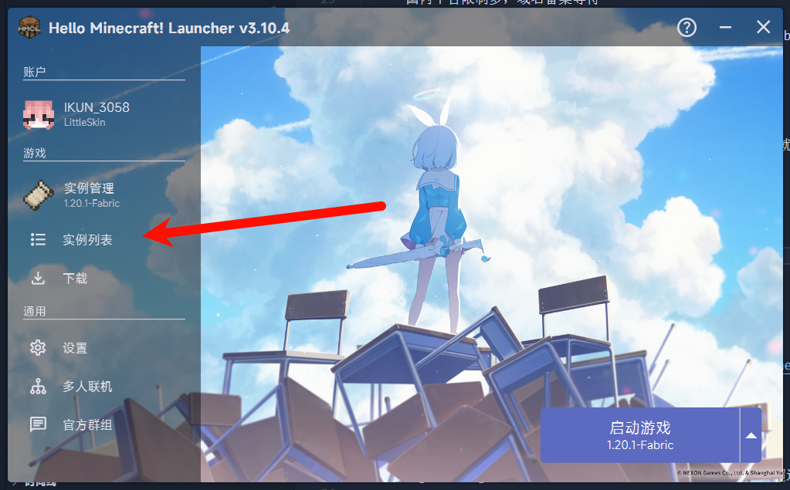
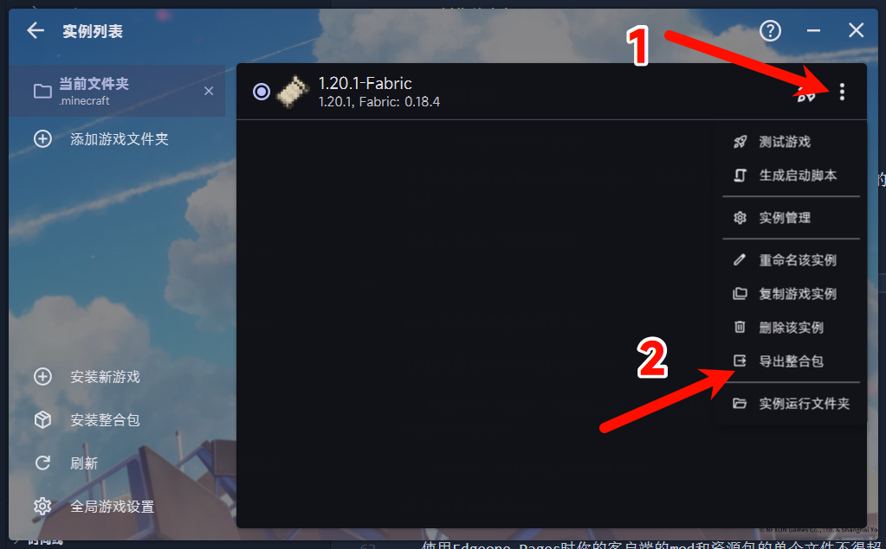
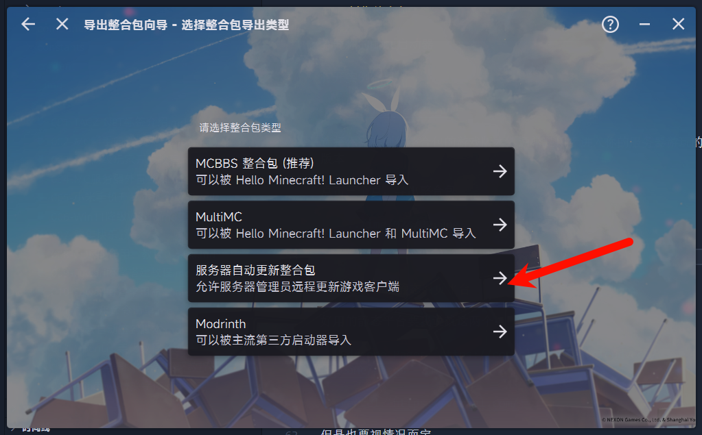
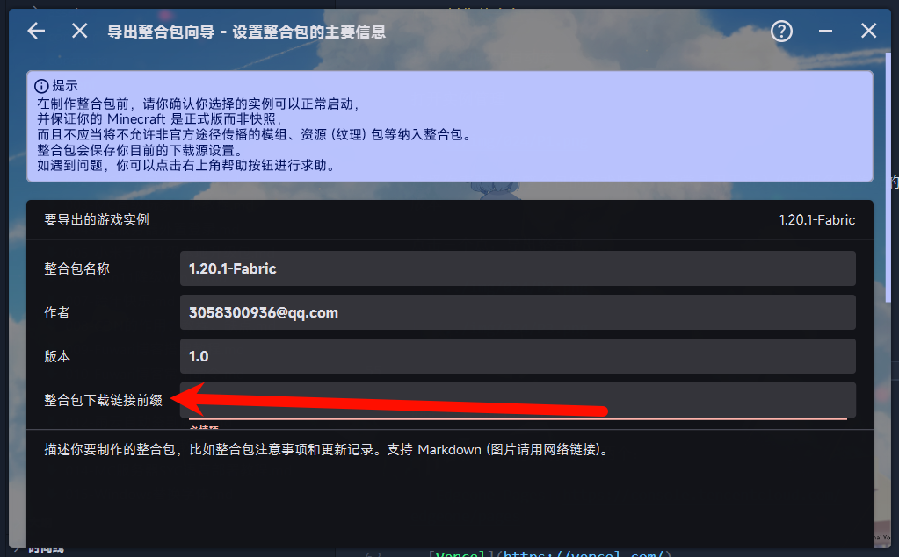
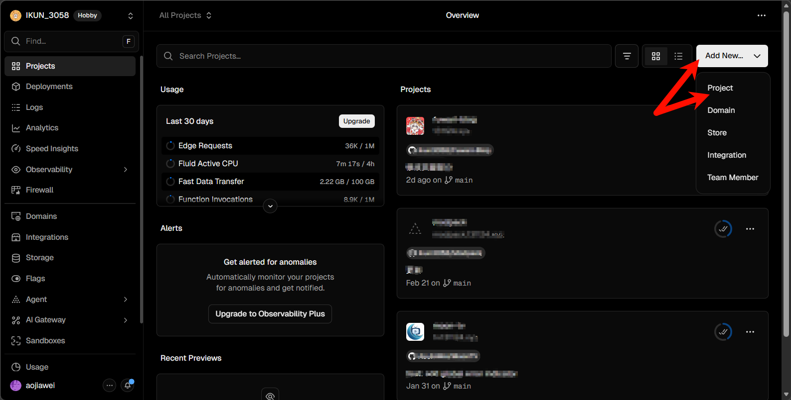

## 前言

MC服务器分为纯净服（vanilla）和mod服（Fabric核心等支持安装mod插件的服务器）

客户端需要保持和服务器一样的版本，安装一样的mod，才可以和其他服务器玩家一起游玩

而每次进行服务器更新时，客户端需要手动下载最新版本的整合包，安装到正确的位置，才能和其他玩家一起游玩

所以就可以使用HMCL的自动更新功能，实现启动时自动更新整合包，无需手动操作

## 制作自动更新的整合包

有不同的方法制作整合包

- 使用静态网站平台建仓存放mod、资源包文件用哈希值匹配GitHub仓库的文件，实现自动更新

    - 零成本但是速度堪忧，玩家等待时间长，海外平台下载慢

    - 国内平台限制多，域名备案等待

- 使用云服务器，用nginx部署静态资源文件，用自动脚本同步GitHub上的资源文件到服务器

    - 成本高，但是速度快，国内平台没有限制

    - 玩家等待时间短，下载速度快

这里只介绍第一种方法，第二种方法需要有一定的服务器知识，这里就不展开介绍了

### 制作整合包

打开你的HMCL启动器

打开实例管理

选择你需要制作整合包的游戏版本，通常是用于进入你的服务器游玩的版本

点击三个点，导出整合包

整合包下载链接前缀写你的域名，没有域名请等到下一步填写你的静态网页托管平台的所分配的域名

选择你需要打包的文件，建议只打包mod和资源包

### 选择你的静态网页平台

好用的静态平台要我说就这两个：

- [Edgeone Pages](https://console.tencentcloud.com/edgeone/pages)

- [Vercel](https://vercel.com/)

但是也要视情况而定：

- 使用Edgeone Pages时你的客户端的mod和资源包的单个文件不得超过50MB

- Vercel没有这个限制，但是在国内需要配置加速器（watt toolkit），否则下载速度会很慢

    或者说优选IP到Vercel的服务器，这个网上教程多就不讲了

### 建GitHub仓库

登录或注册到GitHub网页端，新建一个仓库，用来存放mod、资源包文件

- 仓库名可以自定义，但是建议和你的服务器名称一致，方便管理

- 仓库建议设为公开（public），否则无法被访问

本地使用`Git`命令行工具，将你的mod、资源包文件提交到GitHub仓库

- 第一次提交时，需要先初始化仓库，执行`git init`命令

- 然后添加所有文件到暂存区，执行`git add .`命令

- 提交到本地仓库，执行`git commit -m "initial commit"`命令

- 关联到GitHub仓库，执行`git remote add origin https://github.com/yourusername/yourrepository.git`命令

- 推送到GitHub仓库，执行`git push -u origin master`命令

推送成功后，你可以在GitHub上看到你的整合包文件

[点击此处查看Git常用命令](/posts/011-git常用命令清单/)

记得在根目录创建一个`index.html`文件，随便写点东西（最好是HTML语法）

### 托管到静态网页平台

任意静态网页托管平台

- 选择你新建的仓库

- 部署

- 就好了

最后绑定上你的域名（和你之前在HMCL里面填写的保持一致）

### 尝试启动整合包

将导出的整合包拖进HMCL启动器里面，点击启动按钮，正常启动游戏，表示制作成功

如果制作好后，整合包的体积过大

你可以解压整合包，删除除了`server-manifest.json`文件以外的所有文件，这样可以直接给整合包瘦身到几KB的大小

启动时会自动从你的静态网页托管平台下载所需要的mod和资源包
