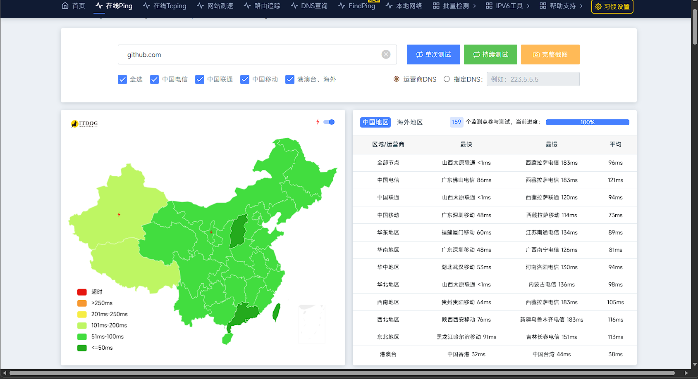
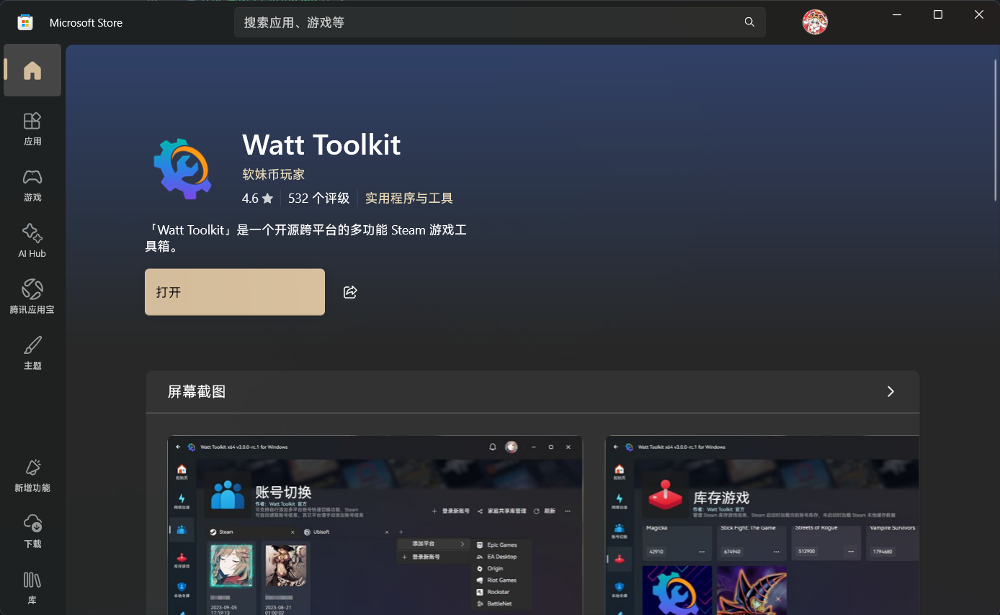
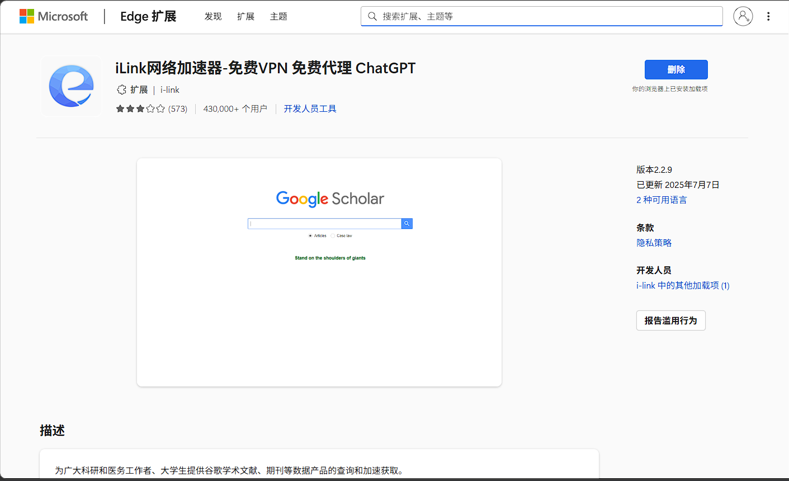
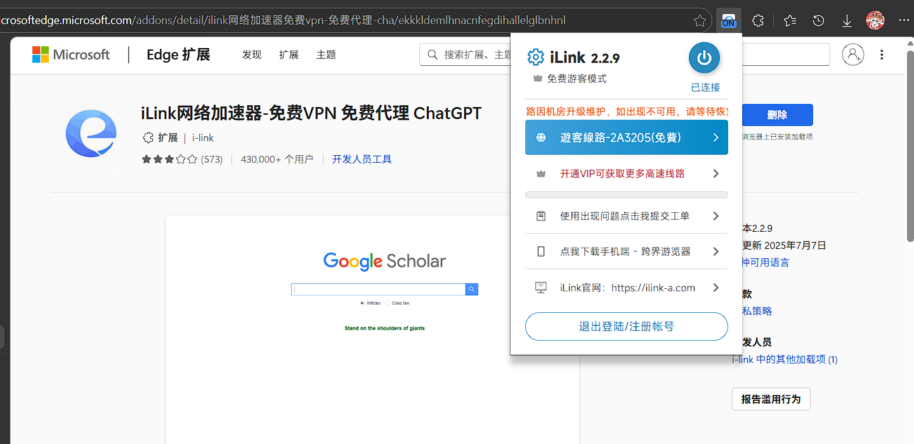

## 前言

所谓"技术无国界"，在现实面前碎成渣渣。看看隔壁Linux社区刚把俄罗斯开发者踢出群聊，就知道开源早成了大国博弈的棋盘。西方巨头们玩得一手双标：需要廉价劳动力时喊你共建生态，忌惮你崛起时就拔网线。

今天有多少项目组在哀嚎？企业CI/CD流水线崩了，实习生连文档都查不了，新手程序员刚学的git clone秒变屠龙技。国内某自动驾驶公司CTO吐槽："版本控制乱成毛线球，重建工具链至少三周"。

## 为什么会墙GitHub

1. 网络安全与数据合规要求：根据《网络安全法》《数据安全法》《个人信息保护法》等法规，境外平台若涉及中国用户数据存储、跨境传输，需符合数据本地化与安全审查要求。GitHub 服务器与数据均在境外，其部分代码仓库可能包含敏感技术信息、违规工具（如翻墙程序、攻击脚本），存在数据泄露与网络安全风险，相关管控是为防范此类隐患。

2. 防范违规内容与网络风险：GitHub 作为开放式平台，可能存在涉及政治敏感、违法违规的代码或内容（如煽动性言论、非法工具发布），网络管理需对这类内容进行过滤，避免其传播带来的社会与安全风险。同时，部分用户可能利用 GitHub 传输敏感数据，管控可减少此类行为的发生。

3. 维护网络主权与意识形态安全：中国实行网络内容管理，旨在抵御境外不良信息渗透，维护国家意识形态安全与社会稳定。对境外平台的访问管理，是平衡对外开放与网络治理的手段，并非针对 GitHub 的专属封锁。

## 方法一：修改Host

GitHub其实在中国境内还是有IP可以访问的，并不是全部都墙掉，也不至于直接DNS劫持

因此我们可以修改Host，将GitHub的域名映射到一个完全可用的IP

### 查找可用的IP

查找IP，测试延迟，我们可以使用一些全球Ping测试的工具，最常用的就是[IT DOG](https://www.itdog.cn/)



这里可以看到基本是可以访问的，只是部分地区还是有劫持或者DNS反馈的IP不可用的情况

查看你所在的地区最快响应的IP是哪个

### 修改Host

Windows 路径为`C:\Windows\System32\drivers\etc\hosts`，需以管理员权限用记事本打开；

macOS/Linux 路径为`/etc/hosts`，需使用 sudo 终端命令修改。修改后保存并在末尾添加 IP 域名 即可。

这样就可以将GitHub域名指向你优选出来的IP了

## 方法二：搭建镜像站

搭建镜像站至少需要一个域名，还有一个灵活的大脑，如果你不会这些，你可以直接使用别的大佬制作好的

如果只是浏览下代码，下载源码之类的需求，你也可以看看`二叉树树`的方案

[二叉树树博客原帖](https://2x.nz/posts/gh-cf/)

只需要使用CloudFlare Wocker配置好路由，配置泛域名DNS记录

即可通过一下格式打开你的镜像站

```
https://github-com-gh.你的域名.com/ikun3058
```

看看代码肯定是没有任何问题的

## 方法三：使用加速器类的工具

加速器相较于梯子，其实实现的效果都是一样的，而梯子，大部分机场的IP都是不干净的，大部分都可能到时封号，全局挂上的话可能封掉更多平台的号（前几天我的Google号刚被封）

强烈推荐Watt加速器，可以免费加速多个平台



勾选上GitHub就好了，如果你还有Steam，也可以使用它加速，对于Steam其实使用大厂加速器会更好

## 方法四：浏览器插件

这个方案更是强烈推荐，这个浏览器插件不止可以访问GitHub，还可以使用Google，ChatGPT等平台



[点击跳转](https://microsoftedge.microsoft.com/addons/detail/ilink%E7%BD%91%E7%BB%9C%E5%8A%A0%E9%80%9F%E5%99%A8%E5%85%8D%E8%B4%B9vpn-%E5%85%8D%E8%B4%B9%E4%BB%A3%E7%90%86-cha/ekkkldemlhnacnfegdihallelglbnhnl)



直接登录然后启动就好了