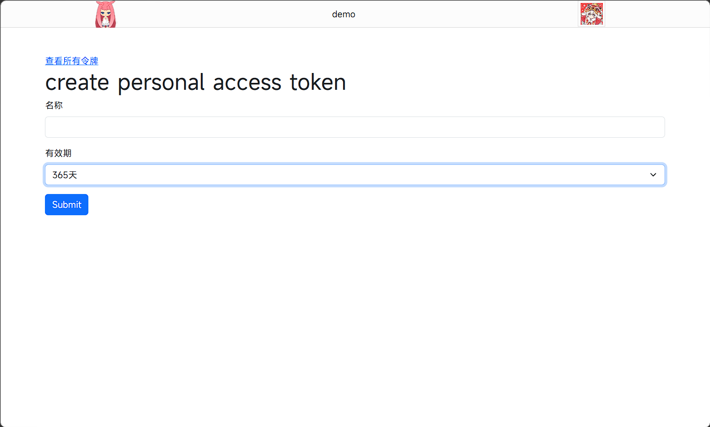
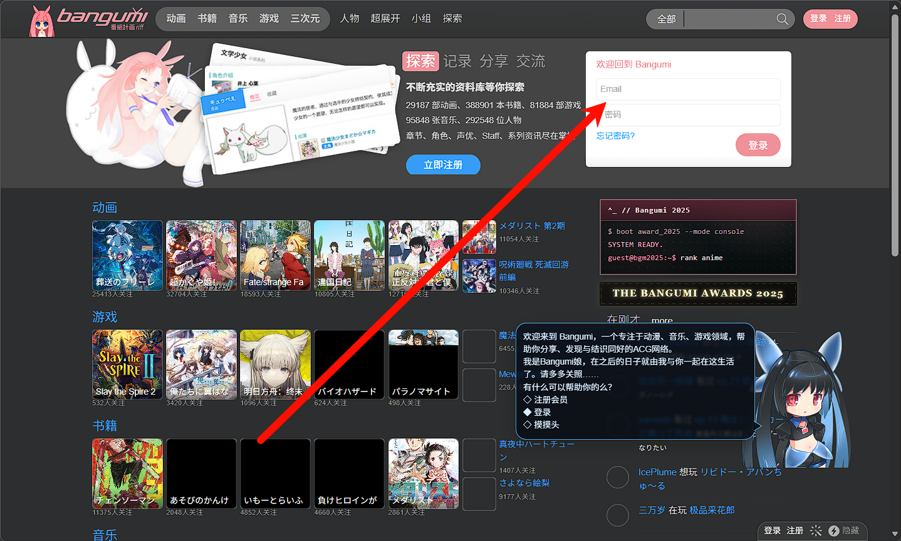
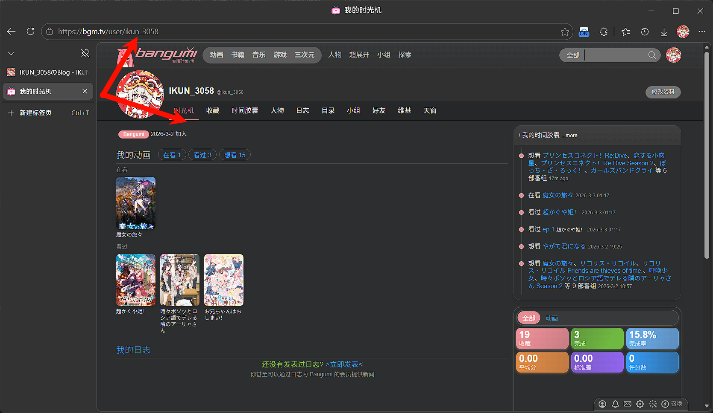
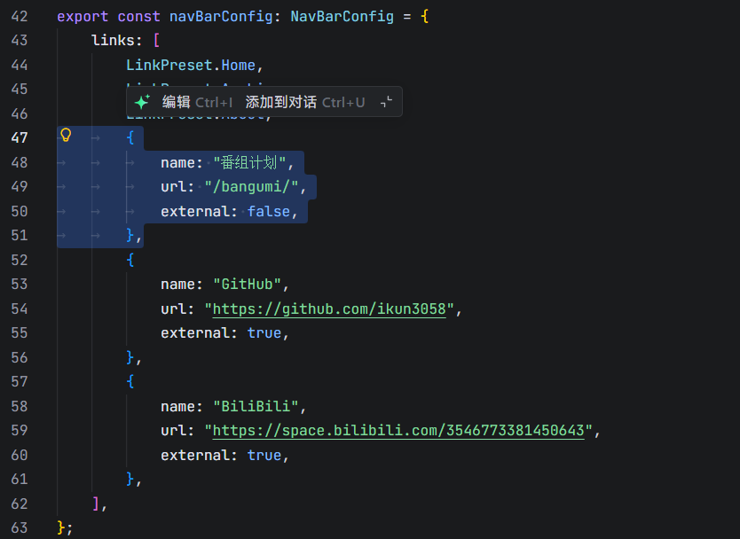

## 获取你的专属Token

由于这个项目的核心功能都是调用的Bangumi上的资源获取的，所以你需要你的专属Token来调用Bangumi的API。

[点击链接前往获取你的专属Token](https://next.bgm.tv/demo/access-token)

登录后点击`创建个人令牌`



自定义一个名称，然后选择有效期

注意令牌仅出现一次，后续不可再次查看，请保存好

## 获取账户ID

[跳转到Bangumi官网登录](https://bgm.tv/)



正常登录上，进入`我的时光机`



看到此界面URL部分，`user`后面的字段复制下来，也就是图片内`ikun3058`部分

## 在你的Fuwari中添加这个界面

进入Fuwari的目录，找到`/src/pages/`，在这个目录下创建一个名为`bangumi.astro`的文件，填写一下代码：

在开头部分填写好之后不需要动下面的任何部分，如果你需要修改一下别的

```
---
// 请替换为你自己的信息
const uid = "此处为ID";        // 替换为你的ID
const token = 'urN************************************Mdq';     // 替换为你的 access_token
const base = 'https://api.bgm.tv/v0';

// --- 类型定义 ---
type Cat = 'watching' | 'wish' | 'collect';
type CatNum = 3 | 1 | 2;

interface Image {
  large?: string;
  common?: string;
  medium?: string;
  small?: string;
  grid?: string;
}

interface Subject {
  id: number;
  type: number;
  name: string;
  name_cn: string;
  eps?: number;
  images?: Image;
}

interface CollectionItem {
  subject_id: number;
  subject: Subject;
  ep_status: number;
  type: CatNum;
}

interface CollectionResponse {
  data: CollectionItem[];
  limit: number;
  offset: number;
  total: number;
}

const cats = [
  { key: 'watching', name: '在看', type: 3 },
  { key: 'wish',     name: '想看', type: 1 },
  { key: 'collect',  name: '看完', type: 2 },
];

// --- 数据获取 ---
async function fetchOnce(type: CatNum): Promise<CollectionItem[]> {
  try {
    const res = await fetch(
      `${base}/users/${uid}/collections?subject_type=2&type=${type}&limit=50`,
      { headers: { Authorization: `Bearer ${token}` } }
    );

    if (!res.ok) {
      console.error(`API Error (${type}):`, res.status, await res.text());
      return [];
    }

    const json: CollectionResponse = await res.json();
    return Array.isArray(json.data) ? json.data : [];
  } catch (err) {
    console.error('Fetch error:', err);
    return [];
  }
}

let allDataFetched = true;
const data: Record<Cat, CollectionItem[]> = { watching: [], wish: [], collect: [] };

try {
  const results = await Promise.all(cats.map(({ type }) => fetchOnce(type)));
  cats.forEach(({ key }, i) => { data[key] = results[i]; });
} catch (err) {
  console.error("Fetch failed:", err);
  allDataFetched = false;
}

import MainGridLayout from "../layouts/MainGridLayout.astro";
---

<MainGridLayout title="Bangumi 追番" description="我的动画收藏列表" class="bangumi-page">
  <div class="flex w-full rounded-[var(--radius-large)] overflow-hidden relative min-h-32 shadow-sm">
    <div class="card-base z-10 px-4 sm:px-6 py-6 relative w-full">
      <h1 class="text-2xl font-bold mb-6 dark:text-white">我的 Bangumi 追番</h1>

      {allDataFetched ? (
        <>
          <!-- 标签页 -->
          <div class="flex border-b border-gray-200 dark:border-gray-700 mb-6" role="tablist" id="bangumi-tabs">
            {cats.map(({ key, name }, i) => (
              <button
                id={`tab-${key}`}
                class="tab-button px-4 py-2 font-medium text-sm transition-colors text-gray-500 hover:text-gray-700 dark:text-gray-400 dark:hover:text-gray-300"
                data-target={key}
                role="tab"
                aria-selected={i === 0 ? "true" : "false"}
              >
                {name}（{data[key].length}）
              </button>
            ))}
          </div>

          <!-- 内容区 -->
          <div class="mt-4 bangumi-content-container">
            {cats.map(({ key, name }, i) => (
              <section
                id={key}
                role="tabpanel"
                class={`bangumi-section ${i !== 0 ? 'hidden' : ''}`}
                aria-hidden={i !== 0}
              >
                {data[key].length ? (
                  <div class="grid grid-cols-2 sm:grid-cols-3 md:grid-cols-4 lg:grid-cols-5 gap-4">
                    {data[key].map(item => {
                      const s = item.subject;
                      const total = s.eps || 0;
                      const watched = item.ep_status || 0;
                      const percent = total ? Math.min(100, Math.round((watched / total) * 100)) : 0;
                      const img = s.images?.large || s.images?.common || '/default-image.png';
                      const bangumiUrl = `https://bgm.tv/subject/${s.id}`;

                      return (
                        <a href={bangumiUrl} target="_blank" rel="noopener noreferrer" class="block group">
                          <div class="card-base overflow-hidden hover:shadow-lg transition-transform duration-300 group-hover:scale-[1.03] dark:bg-[var(--card-bg)]">
                            <div class="aspect-[3/4] overflow-hidden">
                              
                            </div>
                            <div class="p-3">
                              <h2 class="font-medium text-sm line-clamp-2 mb-2 min-h-[2.5rem] dark:text-white">
                                {s.name_cn || s.name}
                              </h2>
                              <div class="text-xs">
                                <div class="flex justify-between mb-1">
                                  <span class="text-gray-600 dark:text-gray-300">{watched}/{total}</span>
                                  <span class="text-gray-600 dark:text-gray-300">{percent}%</span>
                                </div>
                                <div class="w-full bg-gray-200 dark:bg-gray-700 rounded-full h-1.5">
                                  <div
                                    class="h-1.5 rounded-full transition-all duration-300"
                                    style={`width: ${percent}%; background-color: var(--primary)`}
                                  ></div>
                                </div>
                              </div>
                            </div>
                          </div>
                        </a>
                      );
                    })}
                  </div>
                ) : (
                  <div class="text-center py-12 text-gray-500 dark:text-gray-400">
                    暂无 {name} 的记录
                  </div>
                )}
              </section>
            ))}
          </div>
        </>
      ) : (
        <div class="text-center py-12 text-red-500 dark:text-red-400">
          数据加载失败，请检查网络或稍后重试。
        </div>
      )}
    </div>
  </div>
</MainGridLayout>

<!-- 客户端交互 -->
<script is:inline>
  // 最简单的选项卡切换函数
  function switchTab(clickedTab) {
    // 获取所有选项卡和内容区域
    const tabs = document.querySelectorAll('#bangumi-tabs .tab-button');
    const sections = document.querySelectorAll('.bangumi-section');
    
    // 重置所有选项卡
    tabs.forEach(tab => {
      tab.classList.remove('border-b-2', 'border-primary', 'text-primary');
      tab.classList.add('text-gray-500');
      tab.setAttribute('aria-selected', 'false');
    });
    
    // 设置当前选项卡
    clickedTab.classList.remove('text-gray-500');
    clickedTab.classList.add('border-b-2', 'border-primary', 'text-primary');
    clickedTab.setAttribute('aria-selected', 'true');
    
    // 切换内容区域
    const targetId = clickedTab.dataset.target;
    sections.forEach(section => {
      if (section.id === targetId) {
        section.classList.remove('hidden');
      } else {
        section.classList.add('hidden');
      }
    });
  }

  // 初始化函数
  function initBangumiTabs() {
    const tabs = document.querySelectorAll('#bangumi-tabs .tab-button');
    
    // 为每个选项卡绑定点击事件
    tabs.forEach(tab => {
      // 直接绑定事件，避免使用cloneNode导致的问题
      tab.addEventListener('click', function() {
        switchTab(this);
      });
    });
    
    // 激活第一个选项卡
    const firstTab = document.querySelector('#bangumi-tabs .tab-button');
    if (firstTab) {
      switchTab(firstTab);
    }
  }

  // 页面加载时初始化
  if (document.readyState === 'loading') {
    document.addEventListener('DOMContentLoaded', initBangumiTabs);
  } else {
    initBangumiTabs();
  }
  
  // Swup 页面切换时重新初始化
  if (window.swup) {
    window.swup.hooks.on('page:view', function() {
      setTimeout(initBangumiTabs, 50);
    });
  }
</script>

<!-- 全局样式 -->
<style is:global>
  .line-clamp-2 {
    display: -webkit-box;
    -webkit-line-clamp: 2;
    -webkit-box-orient: vertical;
    overflow: hidden;
  }
</style>
```

## 去config.ts中添加这个界面



这样子填写好就好了

现在部署你的Fuwari博客，现在就会在顶栏显示出来了，可能功能上有点问题，如果你修复了这份代码中的问题，麻烦你联系一下我好不QWQ

[给我发一份邮件八](mailto:ikun3058@131124.xyz)